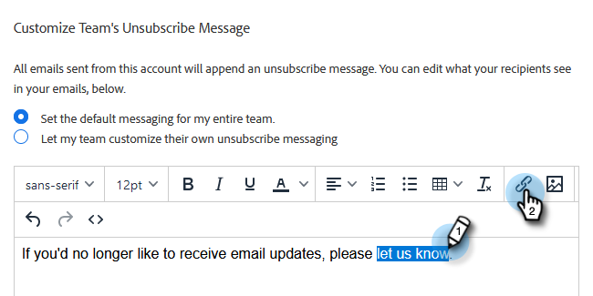
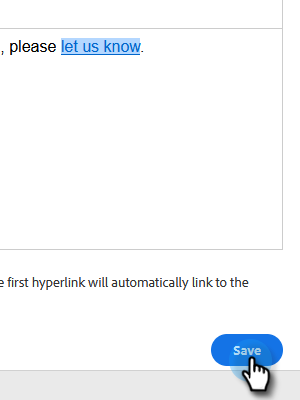

# 登録解除リンクメッセージのカスタマイズ {#customize-unsubscribe-link-message}

これまでもチームは常に配信停止リンクメッセージをカスタマイズできましたが、管理者は、チーム全体に対して配信停止リンクメッセージを設定し、メッセージの一貫性を保つことができます。

>[!NOTE]
>
>[!DNL Marketo Sales] ではサードパーティの登録解除リンクは使用できません。この情報は、アドビのデータベースに取り込まれないからです。

1. 歯車アイコンをクリックし、「**[!UICONTROL 設定]**」を選択します。

   

1. 「[!UICONTROL 管理者設定]」で、「**[!UICONTROL 登録解除]**」をクリックします。

   

1. このメッセージをチーム全体のデフォルトにするか、チームに独自のメッセージを作成させるかを決定します（この例では、デフォルトのメッセージを選択します）。 テキストボックスにカスタムメッセージを書き出します。

   

1. クリックして登録解除ページに移動するためのテキストをハイライト表示してから、リンクアイコンをクリックします。

   

   >[!NOTE]
   >
   >どんな URL を入力しても構いません。 メールが送信されると、最初の（または唯一の）ハイパーリンクは、デフォルトの配信停止ページに自動的にリンクされます。

1. URL を入力し、現在のウィンドウでリンクを開くか、新しいウィンドウでリンクを開くかを決定して、「**[!UICONTROL 保存]**」をクリックします。

   

1. 下部の「**[!UICONTROL 保存]**」をクリックして、変更を確定します。

   
