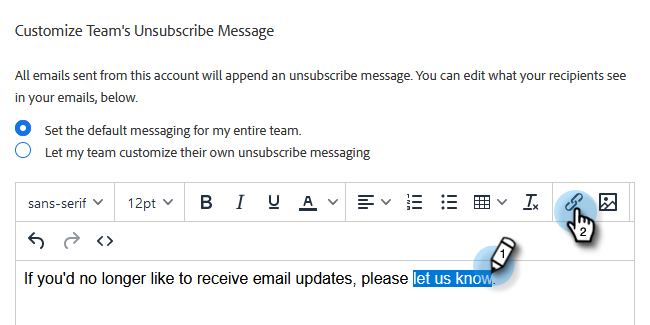

# 配信停止リンクメッセージのカスタマイズ {#customize-unsubscribe-link-message}

これまでもチームは常に配信停止リンクメッセージをカスタマイズできましたが、管理者は、チーム全体に対して配信停止リンクメッセージを設定し、メッセージの一貫性を保つことができます。

>[!NOTE]
>
>Marketo Sales では、サードパーティの配信停止リンクを使用できません。その情報がアドビのデータベースに取り込まれないからです。

1. 歯車アイコンをクリックし、「**設定**」を選択します。

   

1. 「管理設定」で、「**配信停止**」をクリックします。

   

1. このメッセージをチーム全体のデフォルトにするか、チームに独自のメッセージを作成させるかを決定します（この例では、デフォルトのメッセージを選択します）。テキストボックスにカスタムメッセージを書き出します。

   

1. クリックして配信停止ページに移動するテキストをハイライトし、リンクアイコンをクリックします。

   

   >[!NOTE]
   >
   >どんな URL を入力しても構いません。メールが送信されると、最初の（または唯一の）ハイパーリンクは、デフォルトの配信停止ページに自動的にリンクされます。

1. URL を入力し、現在のウィンドウでリンクを開くか、新しいウィンドウでリンクを開くかを決定して、「**保存**」をクリックします。

   

1. 下部の「**保存**」をクリックして、変更を確定します。

   
