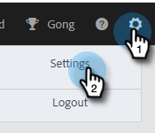

# [!UICONTROL Marketo 登録解除チェック] {#marketo-unsubscribe-check}

[!UICONTROL Marketo 登録解除チェック]は、チームの Marketo への接続を使用して、Marketo のリード管理システムで登録解除になっているユーザにメールが送信されるのを防ぎます。 セールスユーザが [!DNL Marketo Sales] を使用してメールを送信すると、Marketo に対する API 呼び出しが実行され、そのメール ID が登録解除されているかどうかを確認します。 配信停止の場合、メール送信がブロックされます。

>[!NOTE]
>
>**管理者権限が必要**

## オンにする {#turning-it-on}

1. 歯車アイコンをクリックし、「**[!UICONTROL 設定]**」を選択します。

   

1. 「[!UICONTROL 管理者設定]」で、「**[!UICONTROL 登録解除]**」をクリックします。

   

1. 「**[!UICONTROL 統合]**」タブをクリックします。 「[!UICONTROL Marketo 登録解除チェック]」セクションで、スライダーをクリックしてチェックを有効にします。

   

## 留意事項 {#things-to-know}

Marketo 配信停止チェックの留意事項は次のとおりです。

* API の制限に対してはカウントしません
* Marketo 接続が確立されている必要があります
* グローバル設定です
* Web アプリケーション、メールクライアント、[!DNL Salesforce] から送信されるメールをブロックします
