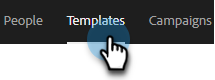

# トランザクションセールスメールテンプレート {#transactional-sales-email-templates}

取引メールや非商用メールを送信する場合、メールテンプレートを非商用メールとしてマークすることで、配信停止を回避できます。

## 注意事項 {#things-to-note}

* 非商用メールは、セールスの登録解除と[Marketo Engageの登録解除チェック ](/help/marketo/product-docs/marketo-sales-insight/actions/email/unsubscribes/marketo-unsubscribe-check.md){target="_blank"}をバイパスしますが、[ ブロックされたドメイン ](/help/marketo/product-docs/marketo-sales-insight/actions/admin/blocked-domains.md){target="_blank"}はバイパスされません。

* 購読解除メッセージの追加管理設定](/help/marketo/product-docs/marketo-sales-insight/actions/email/unsubscribes/auto-append-unsubscribe-message-setting.md){target="_blank"}が有効になっている場合でも、購読解除メッセージは非商用メールに自動的に追加されません。 [ただし、`{{team_unsubscribe}}` [動的フィールド ](/help/marketo/product-docs/marketo-sales-insight/actions/templates/dynamic-fields.md){target="_blank"}は、引き続きチームの購読解除メッセージに入力されます。

## 非商用利用のためのメールテンプレートの設定 {#configure-an-email-template-for-non-commercial-use}

1. ヘッダーで、**テンプレート**&#x200B;をクリックします。

   

1. 更新するテンプレートを検索して選択します。

   

1. テンプレート設定で非商用メールトグルを有効にします。

   

## 商用以外の電子メールの送信 {#send-a-non-commercial-email}

>[!NOTE]
>
>購読解除したユーザーを選択すると、オレンジ色で強調表示されます。

1. ヘッダーで、**作成**&#x200B;をクリックします。 目的の非商用テンプレートを検索して選択します。

   

1. ユーザーは、非商用メールテンプレートを選択したことを示すバナーを見ることができます。

   

1. 「**送信**」をクリックします。

   

登録解除しても、メールは送信されます。
