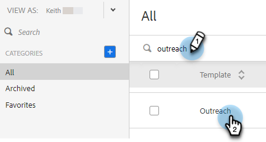
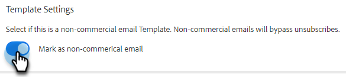

# トランザクションセールスメールテンプレート {#transactional-sales-email-templates}

チームがトランザクションメールまたは非商用メールを送信する場合、メールテンプレートを非商用としてマークして、配信停止を回避できます。

## 注意事項 {#things-to-note}

* 非商用メールは、セールス配信停止および [Marketo Engage配信停止の確認](/help/marketo/product-docs/marketo-sales-insight/actions/email/unsubscribes/marketo-unsubscribe-check.md){target="_blank"}, but will not bypass [blocked domains](/help/marketo/product-docs/marketo-sales-insight/actions/admin/blocked-domains.md){target="_blank"}.

* 配信停止メッセージは、商用以外のメールに対して [配信停止メッセージの追加の管理者設定](/help/marketo/product-docs/marketo-sales-insight/actions/email/unsubscribes/auto-append-unsubscribe-message-setting.md){target="_blank"} is enabled. However, the `{{team_unsubscribe}}` [dynamic field](/help/marketo/product-docs/marketo-sales-insight/actions/templates/dynamic-fields.md){target="_blank"} チーム配信停止メッセージが引き続き表示されます。

## 非商用で使用するための電子メールテンプレートの設定 {#configure-an-email-template-for-non-commercial-use}

1. ヘッダーで、 **テンプレート**.

   

1. 更新するテンプレートを選択します。

   

1. 「テンプレート設定」で、非商用電子メールの切り替えを有効にします。

   

## 非商用メールの送信 {#send-a-non-commercial-email}

>[!NOTE]
>
>配信停止済みの担当者を選択すると、オレンジ色でハイライト表示されます。

1. ヘッダーで、 **作成**. 目的の非商用テンプレートを検索して選択します。

   

1. 非商用の E メールテンプレートを選択したことを示すバナーが表示されます。

   

1. 「**送信**」をクリックします。

   

ユーザーが購読を解除しても、E メールは送信されます。
