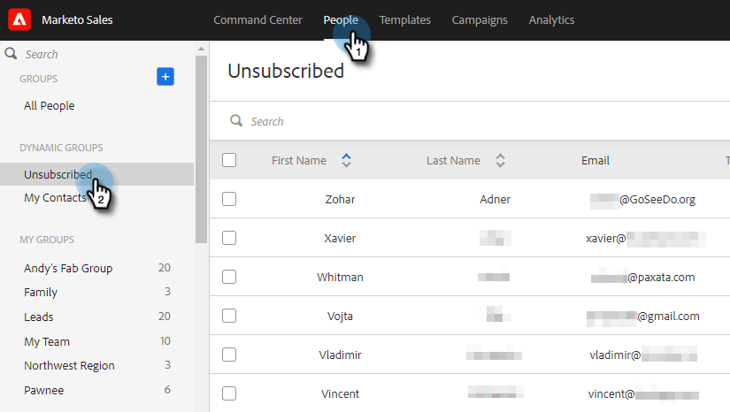
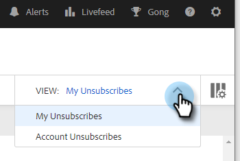

# 登録解除の概要 {#unsubscribe-overview}

組織によるメールのプライバシーに関する法律への準拠はますます重要になっています。 これを支援するために、アドビは配信停止エクスペリエンスをいくつか強化しました。

* 登録解除リンクは、[!DNL Marketo Sales] および [!DNL Salesforce] から送信されるすべてのメールに配置されます（[!DNL Outlook] または Gmail から送信されるカスタムメールには適用されません）
* 管理者は、チーム全体の配信停止メッセージを編集できます
* 配信停止情報は PDV に保存されます
* 登録解除は手動で行うことができます。クリック済みリンク、[!DNL Salesforce] 同期、バウンスです。
* 新しい登録解除リンクランディングページ

## リンクの登録解除ランディングページ {#unsubscribe-link-landing-page}

ユーザが配信停止リンクをクリックすると、配信停止ランディングページが表示され、配信停止元とその理由を選択できます。

この情報は、後で表示するために人物の詳細表示に保存されます。

## 登録解除グループ {#unsubscribe-group}

配信停止済みの人物をすべて 1 か所で表示および管理します。

配信停止済みの人物を検索するには、検索バーを使用します。

管理者の場合は、購読解除グループに移動して、[!UICONTROL &#x200B; アカウント購読解除]でフィルタリングし、人物データベースで収集されたすべての購読解除を確認できます。

## 登録解除履歴カード {#unsubscribe-history-card}

[!UICONTROL 登録解除履歴]カードを使用すると、管理者やユーザは、取引先責任者の登録解除履歴に関するコンテキスト情報を取得できます。 「[!UICONTROL 人物]」タブに移動し、人物を選択して移動します。 人物の詳細ビューの「[!UICONTROL 約]」タブの下部にあります。

>[!NOTE]
>
>その人物がある時点で&#x200B;_再購読_&#x200B;した場合、[!UICONTROL 登録解除履歴]カードのみ表示されます。

<table>
 <colgroup>
  <col>
  <col>
 </colgroup>
 <tbody>
  <tr>
   <td><strong>[!UICONTROL 日付]</strong></td>
   <td>
登録解除／再購読が行われた日付を表示します。
</td>
  </tr>
  <tr>
   <td><strong>[!UICONTROL 詳細]</strong></td>
   <td>
再購読：[!DNL Sales Connect] 管理者が、取引先責任者レコードから登録解除を手動で削除した。 また、取引先責任者の配信停止理由に関する詳細も表示されます。

配信停止：取引先責任者が配信停止された。
</td>
  </tr>
  <tr>
   <td><strong>[!UICONTROL ソース]</strong></td>
   <td>
[!DNL Salesforce] 同期：登録解除が [!DNL Salesforce] の同期によって取得された。

手動：ユーザが「配信停止」ボタンをクリックしてオプトアウトした。

リンクをクリック：メールの受信者が配信停止リンクをクリックした。

「管理者名」：管理者の名前は、アクションが取引先責任者の再購読の場合に表示されます。 ユーザーは誰が登録解除を削除したかを知ることができます。
</td>
  </tr>
 </tbody>
</table>

>[!MORELIKETHIS]
>
>[配信停止リンクメッセージのカスタマイズ](/help/marketo/product-docs/marketo-sales-insight/actions/email/unsubscribes/customize-unsubscribe-link-message.md)
