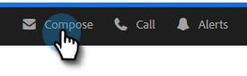
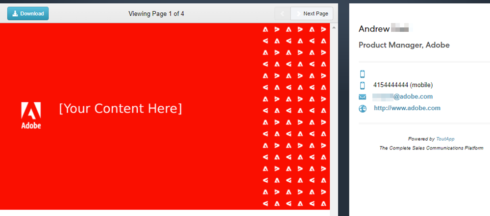

# メールへの添付ファイルまたはトラック可能なコンテンツの追加 {#add-an-attachment-or-trackable-content-to-your-email}

Marketo Sales から電子メールを送信する際には、ファイルを添付ファイルとして追加するか、ファイルをダウンロード可能（かつ追跡可能）リンクにするかを選択できます。

>[!NOTE]
>
>通常、20 MB を超えるファイルは大きすぎて配信できません。E メール経由で送信できる添付ファイルのサイズは、使用している E メール配信チャネルによって異なります。

## 添付ファイルの追加 {#add-an-attachment}

1. メールの下書きを作成します ( 複数の方法があります。この例では、 **作成** を参照 )。

   

1. 「宛先」フィールドに入力し、「件名」を入力します。

   

1. 添付ファイルアイコンをクリックします。

   

1. 添付するファイルを選択し、 **挿入**.

   

   >[!NOTE]
   >
   >ファイルをアップロードする必要がある場合は、 **コンテンツをアップロード** 」ボタンをクリックします。

   添付ファイルが E メールの下部に表示されます。

   

## 追跡可能コンテンツを追加 {#add-trackable-content}

1. メールの下書きを作成します（複数の方法があります。この例では、作成ウィンドウを選択します）。

   

1. 「宛先」フィールドに入力し、「件名」を入力します。

   

1. 追跡可能なコンテンツを表示する E メール内のスポットをクリックし、添付アイコンをクリックします。

   

1. 追加するコンテンツを選択し、 **コンテンツを追跡** スライダをクリックし、 **挿入**.

   

   >[!NOTE]
   >
   >ファイルをアップロードする必要がある場合は、 **コンテンツをアップロード** 」ボタンをクリックします。

   コンテンツは E メール内にリンクとして表示されます。 受信者は、このリンクをクリックしてコンテンツをダウンロードできます。

   

   >[!NOTE]
   >
   >ユーザーが追跡されたコンテンツを閲覧すると、ライブフィードに通知が表示されます。 また、最もパフォーマンスの高いコンテンツを Analytics ページの「コンテンツ」セクションに表示することもできます。

## 追跡可能なコンテンツ更新 {#trackable-content-updates}

**追跡可能なコンテンツビューア**

リードがメール内の追跡可能なコンテンツをクリックすると、コンテンツビューアが開きます。

コンテンツビューア内では、リードは次の操作を実行できます。

* ドキュメントをダウンロード

* ドキュメント全体のページ

* 送信者の連絡先情報を表示

**ライブフィード内の追跡可能なコンテンツイベント**

リードがドキュメントのリンクをクリックすると、クリックイベントが表示されます。 そのリンクをクリックすると、コンテンツを表示できます。 ブラウザーでアクションアカウントにログインしている限り、これらのクリック数はイベントとしてカウントされません。

リードがドキュメントの別のページに進むたびに、ドキュメントの名前を示すライブフィードに表示されたイベントが表示されます。
