# メールへの添付ファイルまたはトラック可能コンテンツの追加 {#add-an-attachment-or-trackable-content-to-your-email}

[!DNL Marketo Sales] からメールを送信する際には、ファイルを添付ファイルとして追加するか、ファイルをダウンロード可能（かつトラック可能）リンクにするかを選択できます。

>[!NOTE]
>
>通常、20 MB を超えるファイルは大きすぎて配信できません。 メールで送信できる添付ファイルのサイズは、使用しているメール配信チャネルによって異なります。

## 添付ファイルの追加 {#add-an-attachment}

1. メールの下書きを作成します（複数の方法があります。この例では、ヘッダーの「**[!UICONTROL 作成]**」を選択しています）。

   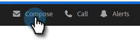

1. 「[!UICONTROL 宛先]」フィールドに入力し、「[!UICONTROL 件名]」を入力します。

   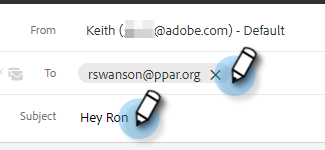

1. 歯車アイコンをクリックします。

   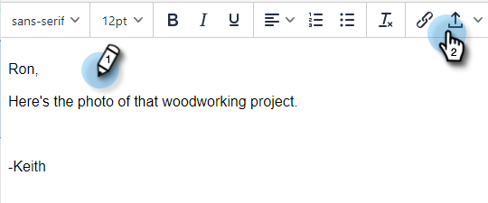

1. 添付するファイルを選択し、「**[!UICONTROL 挿入]**」をクリックします。

   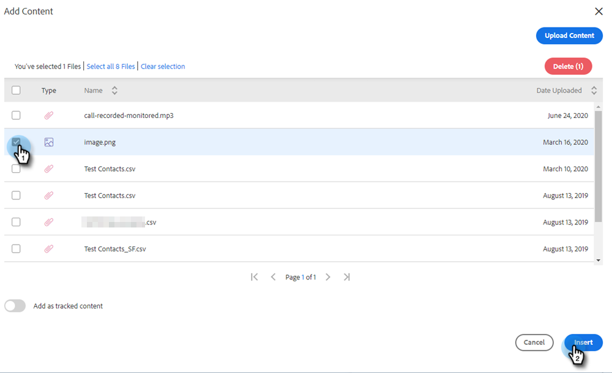

   >[!NOTE]
   >
   >ファイルをアップロードする必要がある場合は、ウィンドウの右上の「**[!UICONTROL コンテンツをアップロード]**」ボタンをクリックします。

   添付ファイルがメールの下部に表示されます。

   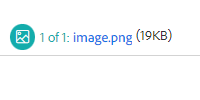

## トラック可能コンテンツを追加 {#add-trackable-content}

1. メールのドラフトを作成します（複数の方法があります。この例では、**[!UICONTROL 作成]**&#x200B;ウィンドウを選択します）。

   

1. 「[!UICONTROL 宛先]」フィールドに入力し、「[!UICONTROL 件名]」を入力します。

   

1. トラック可能コンテンツを表示するメール内のスポットをクリックし、添付アイコンをクリックします。

   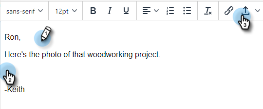

1. 追加するコンテンツを選択し、**[!UICONTROL コンテンツをトラック]**&#x200B;スライダーをクリックし、「**[!UICONTROL 挿入]**」をクリックします。

   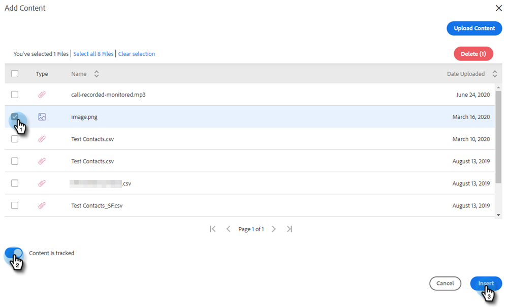

   >[!NOTE]
   >
   >ファイルをアップロードする必要がある場合は、ウィンドウの右上の「**[!UICONTROL コンテンツをアップロード]**」ボタンをクリックします。

   コンテンツはメール内にリンクとして表示されます。 受信者は、このリンクをクリックしてコンテンツをダウンロードできます。

   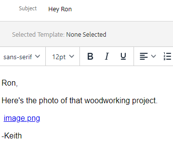

   >[!NOTE]
   >
   >トラックされたコンテンツが閲覧されると、ライブフィードに通知が表示されます。 また、最もパフォーマンスの高いコンテンツを Analytics ページのコンテンツセクションに表示することもできます。

## トラック可能コンテンツの更新 {#trackable-content-updates}

**トラック可能コンテンツビューア**

リードがメール内のトラック可能コンテンツをクリックすると、コンテンツビューアが開きます。

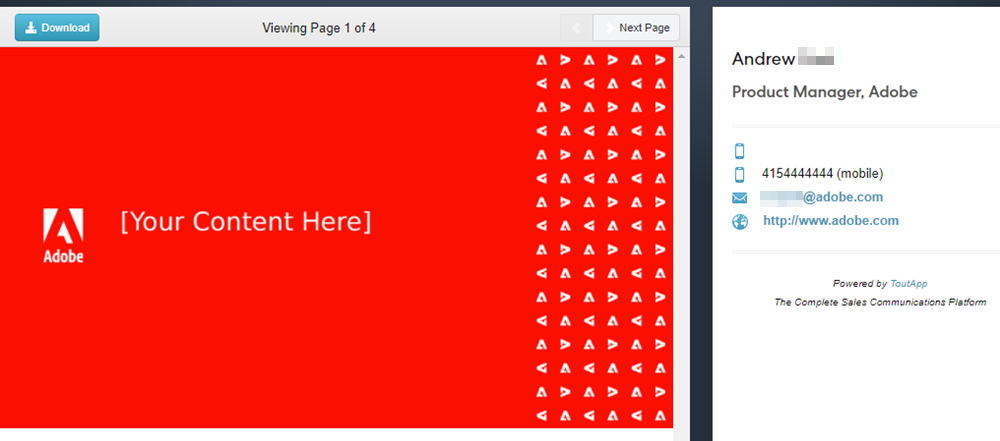

コンテンツビューア内では、リードは次の操作を実行できます。

* ドキュメントのダウンロード

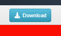

* ドキュメント全体のページ閲覧

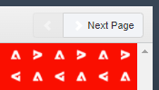

* 送信者の取引先責任者情報の表示

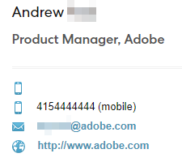

**ライブフィード内のトラック可能コンテンツのイベント**

リードがドキュメントのリンクをクリックすると、クリックイベントが表示されます。 そのリンクをクリックすると、コンテンツを表示できます。 ブラウザーでActions アカウントにログインしている限り、これらのクリックはイベントとしてカウントされません。

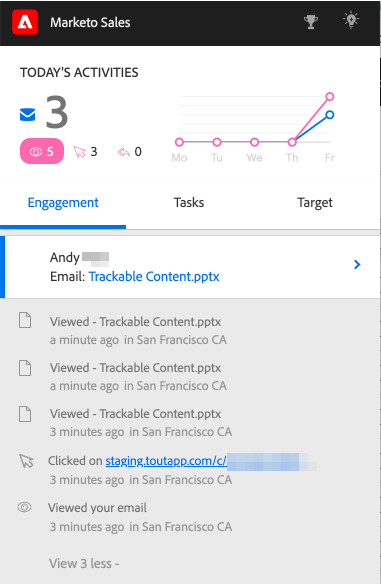

リードがドキュメントの別のページに進むたびに、ドキュメントの名前を示すライブフィードに表示されたイベントが表示されます。
