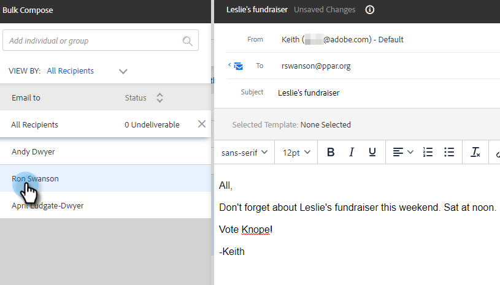

# 「選択して送信」による一括メールの作成 {#composing-bulk-emails-with-select-and-send}

ここでは、「選択して送信」オプションを使用して E メールを送信/編集する方法を説明します。

## メール送信中 {#sending-emails}

1. 人物ページに移動します。

   

1. メールを送信する人を選択します。

   

   >[!NOTE]
   >
   >「選択して送信」を使用する場合は、最大 200 名の担当者を選択できます。

1. 次をクリック： **選択したメール** 」ボタンをクリックします。

   

1. 件名を入力し、テンプレートを選択（またはメールをゼロから作成）して、送信/送信[スケジュール](/help/marketo/product-docs/marketo-sales-connect/email/using-the-compose-window/scheduling-an-email.md) 電子メール。

   

   >[!NOTE]
   >
   >テンプレートを選択し、送信前にすべてのダイナミックフィールドが正しく入力されていることを確認する場合は、 **ダイナミックフィールドをプレビュー**. すべての E メールのプレビュー用に、一括サイドバーのすべての受信者が選択されていることを確認します。 1 つの E メールを選択し、 **ダイナミックフィールドをプレビュー**&#x200B;に設定されている場合、その E メールのみがプレビューされます。

## メールの編集 {#editing-emails}

**バルク編集**

1. 次の手順 1～3 に従います。 [E メールの送信の節](#sending-emails) 上

   >[!NOTE]
   >
   >デフォルトでは、すべての受信者が選択されます。 個人をクリックし、全員を再選択する場合は、 **すべての受信者**. 一括編集をおこなうには、すべての受信者を選択する必要があります。

1. エディターで変更を加えます。 新しい E メールを作成したり、テンプレートを編集したりできます（この例では、新しい E メールを作成します）。

   

   >[!NOTE]
   >
   >特定の E メール受信者をクリックすると、その E メールに反映される変更を確認できます。

1. クリック **送信** ( または [スケジュール](/help/marketo/product-docs/marketo-sales-connect/email/using-the-compose-window/scheduling-an-email.md)) をクリックして、一括電子メール更新をおこなったすべての受信者に送信します。

   

**各メールを編集**

一括更新をおこなうと、一括作成サイドバーにあるすべての電子メールの変更が上書きされるので、各電子メールをカスタマイズする前に一括更新を完了してください。

1. 次の手順 1～4 に従います。 [E メールの送信の節](#sending-emails).

   >[!NOTE]
   >
   >デフォルトでは、すべての受信者が選択されます。 個人をクリックし、全員を再選択する場合は、 **すべての受信者**. 一括編集をおこなうには、すべての受信者を選択する必要があります。

1. 個々の受信者を選択します。

   

1. エディターで変更を加えます。

   

   >[!NOTE]
   >
   >ここでは、残りの E メールを更新せずに、バルクサイドバーの 1 つの E メールを編集できます。

   >[!TIP]
   >
   >他の受信者をクリックすると、以前に選択した受信者に加えた変更が表示されないことがわかります。

1. クリック **送信** ( または [スケジュール](/help/marketo/product-docs/marketo-sales-connect/email/using-the-compose-window/scheduling-an-email.md)) をクリックして、一括電子メール更新をおこなったすべての受信者に送信します。

   

   >[!MORELIKETHIS]
   >
   >* [一括電子メールオプション](/help/marketo/product-docs/marketo-sales-insight/actions/email/using-the-compose-window/bulk-emailing-options.md)
   >* [作成ウィンドウでのテンプレートの使用](/help/marketo/product-docs/marketo-sales-connect/email/using-the-compose-window/using-a-template-in-the-compose-window.md)
   >* [動的フィールド](/help/marketo/product-docs/marketo-sales-connect/templates/dynamic-fields/how-to-insert-dynamic-fields.md)

