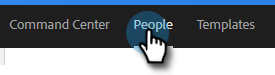
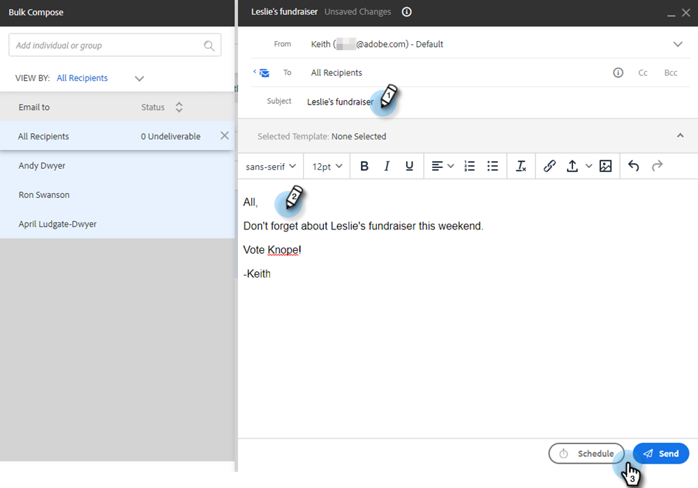

# 「選択して送信」による一括メールの作成 {#composing-bulk-emails-with-select-and-send}

ここでは、「選択して送信」オプションを使用してメールを送信／編集する方法を説明します。

## メールの送信 {#sending-emails}

1. 人物ページに移動します。

   

1. メールする人物を選択します。

   

   >[!NOTE]
   >
   >「選択して送信」を使用する場合は、最大 200 名の人物を選択できます。

1. 「**選択したメール**」ボタンをクリックします。

   

1. 件名を入力し、テンプレートを選択（またはメールをゼロから作成）して、メールを送信または[スケジュール設定](/help/marketo/product-docs/marketo-sales-connect/email/using-the-compose-window/scheduling-an-email.md)します。

   

   >[!NOTE]
   >
   >テンプレートを選択し、送信前にすべての動的フィールドが正しく入力されていることを確認する場合は、「**動的フィールドをプレビュー**」をクリックします。すべてのメールをプレビューするには、一括サイドバーのすべての受信者が選択されていることを確認します。1 つのメールを選択し、「**動的フィールドをプレビュー**」をクリックした場合、そのメールのみがプレビューされます。

## メールの編集 {#editing-emails}

**一括編集**

1. 上記の[メールの送信の節](#sending-emails)の手順 1～3 に従います。

   >[!NOTE]
   >
   >デフォルトでは、すべての受信者が選択されます。個人をクリックし、全員を再選択する場合は、「**すべての受信者**」をクリックします。をクリックします。一括編集を行うには、すべての受信者を選択する必要があります。

1. エディターで変更を加えます。新しいメールを作成したり、テンプレートを編集したりできます（この例では、新しいメールを作成します）。

   

   >[!NOTE]
   >
   >特定のメール受信者をクリックすると、そのメールに反映される変更を確認できます。

1. 「**送信**」（または「[スケジュール](/help/marketo/product-docs/marketo-sales-connect/email/using-the-compose-window/scheduling-an-email.md)」）をクリックして、一括電子メール更新を行ったすべての受信者に送信します。

   

**各メールを編集**

一括更新を行うと、一括作成サイドバーにあるすべてのメールの変更が上書きされるので、各メールをカスタマイズする前に一括更新を完了してください。

1. [メールの送信の節](#sending-emails)の手順 1～4 に従います。

   >[!NOTE]
   >
   >デフォルトでは、すべての受信者が選択されます。個人をクリックし、全員を再選択する場合は、「**すべての受信者**」をクリックします。をクリックします。一括編集を行うには、すべての受信者を選択する必要があります。

1. 個々の受信者を選択します。

   

1. エディターで変更を加えます。

   

   >[!NOTE]
   >
   >ここで、残りのメールを更新せずに、一括サイドバーの 1 つのメールを編集できます。

   >[!TIP]
   >
   >他の受信者をクリックすると、以前に選択した受信者に加えた変更が表示されないことがわかります。

1. 「**送信**」（または「[スケジュール](/help/marketo/product-docs/marketo-sales-connect/email/using-the-compose-window/scheduling-an-email.md)」）をクリックして、一括電子メール更新を行ったすべての受信者に送信します。

   

   >[!MORELIKETHIS]
   >
   >* [一括メール送信オプション](/help/marketo/product-docs/marketo-sales-insight/actions/email/using-the-compose-window/bulk-emailing-options.md)
   >* [作成ウィンドウでのテンプレートの使用](/help/marketo/product-docs/marketo-sales-connect/email/using-the-compose-window/using-a-template-in-the-compose-window.md)
   >* [動的フィールド](/help/marketo/product-docs/marketo-sales-connect/templates/dynamic-fields/how-to-insert-dynamic-fields.md)

