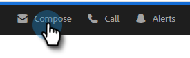

# トラッキングするメールの送信 {#sending-a-tracked-email}

Marketo Sales Connect を使用してメールを送信する際に、表示数（メール開封数）とクリック数（クリックされたリンク数）がトラックされます。

>[!PREREQUISITES]
>
>トラッキングするメールを送信する前に、ID を認証し、メール配信チャネルを設定する必要があります。
>
>* [メールアドレスの確認](/help/marketo/product-docs/marketo-sales-insight/actions/getting-started/email-settings/verify-your-email.md)
>* [Outlook](/help/marketo/product-docs/marketo-sales-connect/email-plugins/msc-for-outlook/email-connection-for-outlook-users.md) または [Gmail](/help/marketo/product-docs/marketo-sales-connect/email-plugins/gmail/email-connection-for-gmail-users.md) の配信チャネルの設定

1. メールの下書きを作成します（複数の方法があります。この例では、ヘッダーの「**作成**」を選択しています）。

   

1. 受信者の名前またはメールアドレスを「**宛先**」フィールドに入力します。

   

   >[!NOTE]
   >
   >「宛先」フィールドに入力できるのは 1 人だけです。

1. CC または BCC を送信する受信者を各フィールドに追加します。

   

   >[!NOTE]
   >
   >CC または BCC で送信されたユーザーがメールを開いた場合、「**宛先**」フィールドに入力した人物の開封として記録されます。

1. 件名を入力します。

   

   >[!NOTE]
   >
   >メールの送信には、件名と受信者が必要です。件名行と受信者が追加されると、**ドラフトが自動的に保存されます**。

1. エディターを使用してメールを作成します。完了したら、「**送信**」（または必要に応じて「[スケジュール](/help/marketo/product-docs/marketo-sales-connect/email/using-the-compose-window/scheduling-an-email.md)」）をクリックします

   

   >[!MORELIKETHIS]
   >
   >* [メールのスケジュール設定](/help/marketo/product-docs/marketo-sales-insight/actions/email/using-the-compose-window/scheduling-an-email.md)
   >* [テンプレート](/help/marketo/product-docs/marketo-sales-insight/actions/templates/manage-templates.md#create-a-new-template)

