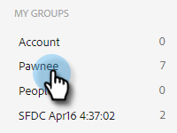
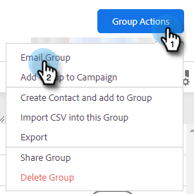
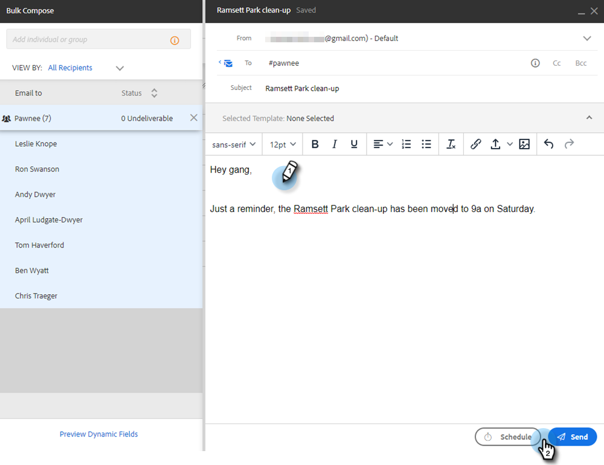
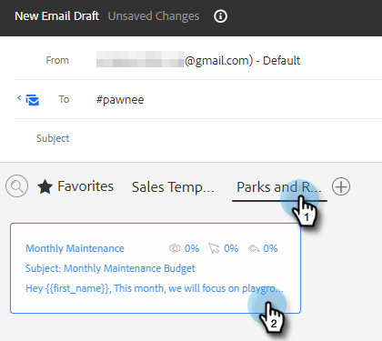
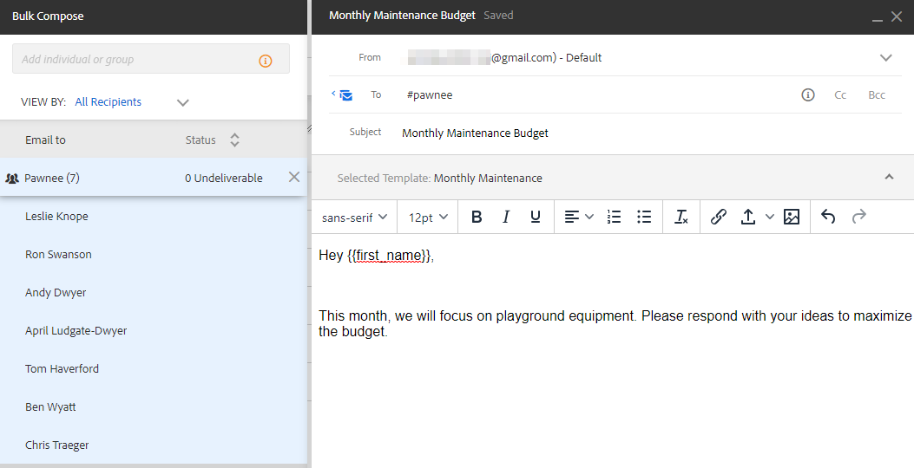
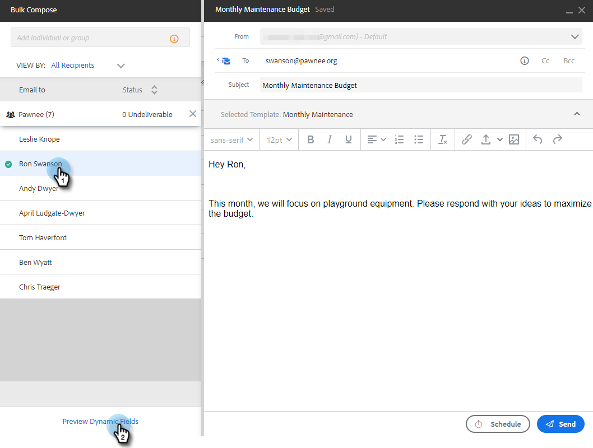

# グループメールによるメールの送信 {#sending-emails-via-group-email}

ここでは、「グループメール」オプションを使用してメールを送信／編集する方法を説明します。

## グループメールの送信 {#sending-a-group-email}

1. 「**[!UICONTROL リード]**」タブをクリックします。

   

1. メールを送信するグループを選択します。

   

1. 「[!UICONTROL グループアクション]」ボタンをクリックし、「**[!UICONTROL グループにメールを送信]**」を選択します。

   

1. メールを入力（またはテンプレートを選択）して、送信（またはスケジュール）します。

   

## グループメールの編集 {#editing-a-group-email}

1. [上記の手順 1～3](#sending-a-group-email) を使用してグループメールを作成します。

1. [テンプレートを選択する](/help/marketo/product-docs/marketo-sales-insight/actions/email/using-the-compose-window/using-a-template-in-the-compose-window.md)か、メールを入力します。

   

1. メール作成が完了したら、リスト内の各メールをプレビューして、動的フィールドに正しく入力されているかどうかを確認できます。

   

1. 目的の受信者を選択し、「**[!UICONTROL 動的フィールドをプレビュー]**」をクリックします。 右側のプレビューを表示します。

   

   >[!NOTE]
   >
   >グループメールを送信する際に、メール／テンプレートに一括編集を行うことはできますが、リスト内の特定の受信者に対して一意の編集を行うことはできません。

>[!MORELIKETHIS]
>
>* [一括送信オプション](/help/marketo/product-docs/marketo-sales-insight/actions/email/using-the-compose-window/bulk-emailing-options.md)
>* [作成ウィンドウでのテンプレートの使用](/help/marketo/product-docs/marketo-sales-insight/actions/email/using-the-compose-window/using-a-template-in-the-compose-window.md)
