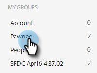
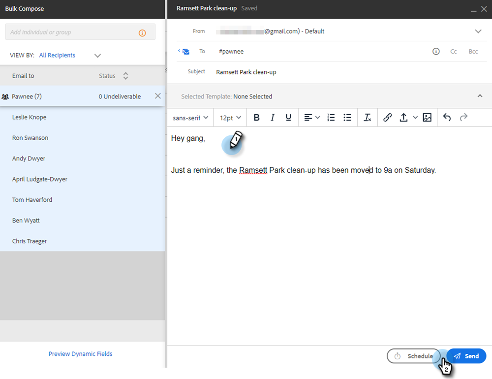

# グループメールを使用したメール送信 {#sending-emails-via-group-email}

ここでは、「グループ電子メール」オプションを使用して電子メールを送信または編集する方法を説明します。

## グループ電子メールの送信 {#sending-a-group-email}

1. 「**リード**」タブをクリックします。

   

1. 電子メールを送信するグループを選択します。

   

1. 「 Group Actions 」ボタンをクリックし、「 」を選択します。 **メールグループ**.

   

1. E メールを入力し（またはテンプレートを選択）、送信（またはスケジュール）します。

   

## グループメールの編集 {#editing-a-group-email}

1. 次を使用してグループメールを作成 [上記の手順 1～3](#sending-a-group-email).

1. [テンプレートを選択](/help/marketo/product-docs/marketo-sales-insight/actions/email/using-the-compose-window/using-a-template-in-the-compose-window.md)または電子メールを入力してください。

   

1. E メールが完了したら、リスト内の各 E メールをプレビューして、動的フィールドに正しく入力されているかどうかを確認できるようになりました。

   

1. 目的の受信者を選択し、 **ダイナミックフィールドをプレビュー**. 右側にプレビューが表示されます。

   

   >[!NOTE]
   >
   >グループメールを送信する際に、電子メール/テンプレートに一括編集を加えることはできますが、リスト内の特定の受信者に対して一意の編集を加えることはできません。

>[!MORELIKETHIS]
>
>* [一括送信オプション](/help/marketo/product-docs/marketo-sales-insight/actions/email/using-the-compose-window/bulk-emailing-options.md)
>* [作成ウィンドウでのテンプレートの使用](/help/marketo/product-docs/marketo-sales-insight/actions/email/using-the-compose-window/using-a-template-in-the-compose-window.md)

