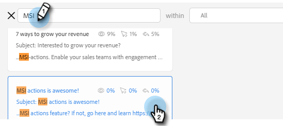

# 作成ウィンドウでのテンプレートの使用 {#using-a-template-in-the-compose-window}

## テンプレートの検索と使用 {#finding-and-using-templates}

1. メールの下書きを作成します（複数の方法があります。この例では、ヘッダーの「**作成**」を選択しています）。

   

1. 「宛先」フィールドに値を入力します。

   

1. 「テンプレート」セクションの「検索」アイコンをクリックして、テンプレート検索フィールドを開きます。

   

1. 検索するカテゴリを選択します（またはすべてのカテゴリを検索するには「すべて」を選択します）。

   

1. テンプレート名、件名、メール本文で検索します。目的のテンプレートをクリックして選択します。

   

   >[!NOTE]
   >
   >別のテンプレートを選択すると、現在エディターにあるすべての情報が置き換えられます。変更を加えた場合は、別のテンプレートを選択する前に、必ずコピーしてください。

## 作成ウィンドウでのテンプレートカテゴリのピン留め {#pinning-template-categories-in-the-compose-window}

特定のテンプレートカテゴリを **5 つまで**&#x200B;お気に入りに設定して、最も使用頻度の高いテンプレートに素早くアクセスできます。

1. メールの下書きを作成します（複数の方法があります。この例では、ヘッダーの「**作成**」を選択しています）。

   

1. **お気に入り**&#x200B;の横にある「+」アイコンをクリックします。

   

1. 「**カテゴリをピン留め**」ドロップダウンをクリックし、目的のカテゴリを選択します。

   

1. 完了したら、「**変更を保存**」をクリックします（オプション：さらに追加する場合は手順 3 を繰り返します）。

   

   >[!TIP]
   >
   >ピン留めしたカテゴリは、変更を保存する前にドラッグ＆ドロップするだけで並べ替えることができます。

   

   >[!NOTE]
   >
   >**お気に入り**&#x200B;はデフォルトで存在します。カテゴリではなく、お気に入りのメールテンプレートが格納されます。

   選択したカテゴリがピン留めされました。
