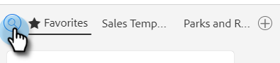
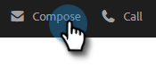
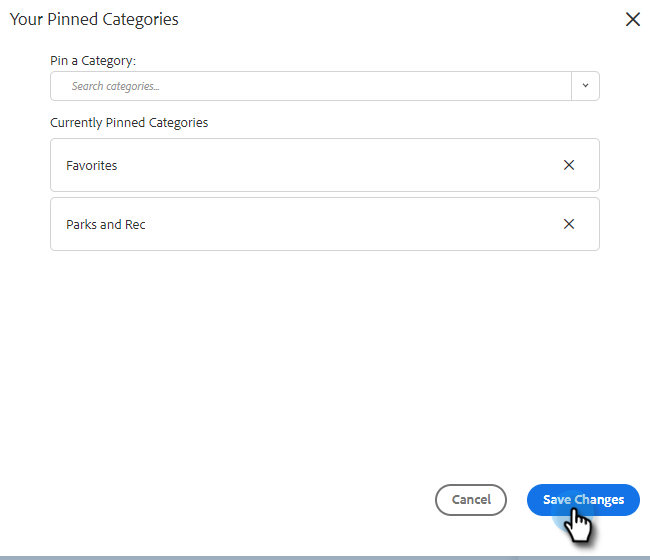
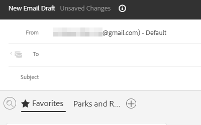

# 作成ウィンドウでのテンプレートの使用 {#using-a-template-in-the-compose-window}

## テンプレートの検索と使用 {#finding-and-using-templates}

1. メールの下書きを作成します（複数の方法があります。この例では、ヘッダーの「**[!UICONTROL 作成]**」を選択しています）。

   

1. 「[!UICONTROL 宛先]」フィールドを入力します。

   

1. 「テンプレート」セクションの「検索」アイコンをクリックして、テンプレート検索フィールドを開きます。

   

1. 検索するカテゴリを選択します（またはすべてのカテゴリを検索するには「[!UICONTROL すべて]」を選択します）。

   

1. テンプレート名、件名、メール本文で検索します。 目的のテンプレートをクリックして選択します。

   

   >[!NOTE]
   >
   >別のテンプレートを選択すると、現在エディターにあるすべての情報が置き換えられます。 変更を加えた場合は、別のテンプレートを選択する前に、必ずコピーしてください。

## 作成ウィンドウでのテンプレートカテゴリのピン留め {#pinning-template-categories-in-the-compose-window}

特定のテンプレートカテゴリを **5 つまで**&#x200B;お気に入りに設定して、最も使用頻度の高いテンプレートに素早くアクセスできます。

1. メールの下書きを作成します（複数の方法があります。この例では、ヘッダーの「**[!UICONTROL 作成]**」を選択しています）。

   

1. [!UICONTROL お気に入り]の横にある「**+**」アイコンをクリックします。

   

1. **[!UICONTROL カテゴリをピン留め]**&#x200B;ドロップダウンをクリックし、目的のカテゴリを選択します。

   

   >[!TIP]
   >
   >多くの場合、すべてのテンプレートを検索して目的のものを見つける必要があるため、テンプレートライブラリ全体を迅速に検索できるように、「すべて」カテゴリをピン留めすることをお勧めします。 ピン留めされたカテゴリを選択して検索アイコンをクリックすると、デフォルトで、選択されたピン留めカテゴリ内を検索します。

1. 完了したら、「**変更を保存**」をクリックします（オプション：さらに追加する場合は手順 3 を繰り返します）。

   

   >[!TIP]
   >
   >ピン留めしたカテゴリは、変更を保存する前にドラッグ＆ドロップするだけで並べ替えることができます。

   

   >[!NOTE]
   >
   >**[!UICONTROL お気に入り]**&#x200B;はデフォルトで存在します。 カテゴリではなく、お気に入りのメールテンプレートが格納されます。

   選択したカテゴリがピン留めされました。
