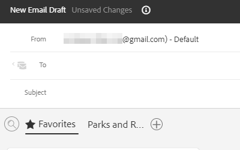

# 作成ウィンドウでのテンプレートの使用 {#using-a-template-in-the-compose-window}

## テンプレートの検索と使用 {#finding-and-using-templates}

1. メールの下書きを作成します ( 複数の方法があります。この例では、 **作成** を参照 )。

   

1. 「宛先」フィールドに値を入力します。

   

1. 「テンプレート」セクションの検索アイコンをクリックして、テンプレート検索フィールドを開きます。

   

1. 検索するカテゴリを選択します（またはすべてのカテゴリを検索するには「すべて」を選択します）。

   

1. テンプレート名、件名、メール本文で検索します。 目的のテンプレートをクリックして選択します。

   

   >[!NOTE]
   >
   >別のテンプレートを選択すると、現在エディターにあるすべての情報が置き換えられます。 変更を加えた場合は、別のテンプレートを選択する前に、必ずコピーしてください。

## 作成ウィンドウでのテンプレートカテゴリのピン留め {#pinning-template-categories-in-the-compose-window}

お気に入り **5 つまで** 特定のテンプレートカテゴリを使用して、最も使用頻度の高いテンプレートにすばやくアクセスできます。

1. メールの下書きを作成します ( 複数の方法があります。この例では、 **作成** を参照 )。

   

1. 次をクリック： **+** お気に入りの横のアイコン

   

1. 次をクリック： **カテゴリの固定** 」ドロップダウンリストから、目的のカテゴリを選択します。

   

1. クリック **変更を保存** 完了時 ( オプション：手順 3 を繰り返して、さらに追加します )。

   

   >[!TIP]
   >
   >固定したカテゴリは、変更を保存する前にドラッグ&amp;ドロップするだけで並べ替えることができます。

   

   >[!NOTE]
   >
   >**お気に入り** はデフォルトで存在します。 カテゴリではなく、お気に入りの電子メールテンプレートが格納されます。

   選択したカテゴリがピン留めされました。
