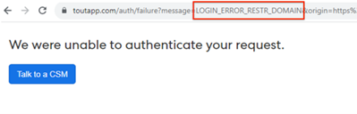

# [!DNL Salesforce] への接続時に「要求を認証できませんでした」と表示される問題を修正する方法 {#how-do-i-fix-we-were-unable-to-authenticate-your-request-when-connecting-to-salesforce}

Marketo Sales インスタンスを Salesforce に接続しようとして「リクエストを認証できません」というエラーが表示される場合は、Salesforce インスタンスの設定に関係している可能性があります。

この失敗した認証ページを生成する可能性のあるエラーには、次の 2 種類があります。

* Login error restricted Domain
* Oauth アプリがブロックされました

URL を確認することで、取得しているタイプを識別できます。

## 制限ドメインのログイン エラーの解決 {#resolve-login-error-restricted-domain}

このエラーは通常、ルーティングできないカスタムドメインがあることを示しています。このエラーを解決するには、まず接続先の Salesforce インスタンスにログインしてみてください。次に、手順を実行して Salesforce に接続します。

接続しようとしているインスタンスが Salesforce サンドボックスドメインであり、エラーが発生している場合は、Salesforce サンドボックスと互換性を持つようにインスタンスを更新するために、追加の手順を実行する必要があります。[詳細情報](/help/marketo/product-docs/marketo-sales-insight/actions/crm/salesforce-integration/set-up-a-sales-insight-actions-sandbox.md){target="_blank"}

## Oauth アプリの解決がブロックされました {#resolve-oauth-app-blocked}

URL 内に「Oauth App Blocked」というエラータイプ（または別のタイプ）が記載された「要求を認証できませんでした」というエラーメッセージが表示された場合は、Salesforce API へのアクセスが制限されている可能性があります。Salesforce 管理者に、以下が実施されていることを確認してください。

### ユーザ権限での API が有効化されている {#enable-api-in-user-permissions}

1. Salesforce 管理者を Salesforce にログインしてもらいます。
1. 「**設定**」を選択します。
1. 「**ユーザを管理**」を選択します。
1. 「**プロファイル**」を選択します。
1. ToutApp ユーザが属するプロファイルを探し、「**編集**」をクリックします。
1. 下の「**管理権限**」までスクロールし、「**API 有効**」がオンになっていることを確認します。

### Salesforce によって Sales Insight Actions の接続がブロックされているかどうかを確認する {#check-if-salesforce-is-blocking-sales-insight-actions-from-connecting}

1. Salesforce 管理者を Salesforce にログインしてもらいます。
1. 「**設定**」を選択します。
1. 「**アプリの管理**」を選択します。
1. 「**接続済みのアプリケーションの OAuth 使用状況**」を選択します。
1. Sales Insight Actions の横に「ブロック」と表示されていることを確認します。「ブロック解除」と表示された場合は、このボタンをクリックして、Sales Insight Actions の Salesforce へのアクセスのブロックを解除します。
