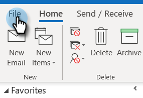
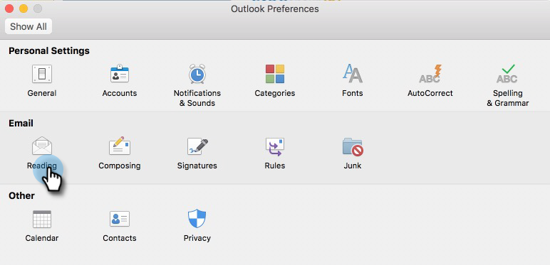
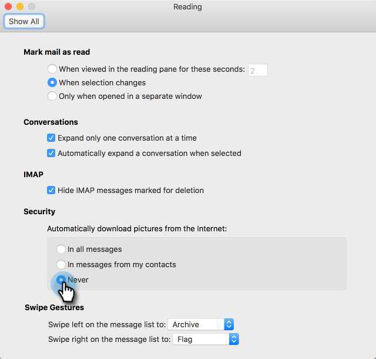

# セルフビューを防ぐには {#how-do-i-prevent-self-views}

ビュートラッキングで偽陽性を取得すると、レポートの不整合が生じる可能性があります。 これは、多くの場合、[!DNL Marketo Sales] のユーザが自分のメールクライアントから誤ってトラッキングピクセルを呼び出した場合に発生します（これをセルフビューと呼びます）。 以下に、セルフビューを大幅に減らし、さらには削除するヒントを示します。

## Web（[!DNL Outlook] web アプリおよび Gmail） {#web-outlook-web-app-and-gmail}

[!DNL Marketo Sales] は、[!DNL Outlook] web アプリおよび Gmail からメールを開いた際に表示がトラックされないように、ブラウザーに cookie を保存します。 まだセルフビューを受け取っている場合は、次の操作をお勧めします。

* お使いのコンピューターで cookie が有効になっていることを確認します。

* 新しいコンピューターまたはモバイルデバイスを使用している場合は、Web アプリケーションにログインしていることを確認してください。 これにより、お使いのコンピューター／デバイスが今後認識されるようになります。

## デスクトップ（Windows） {#desktop-windows}

ビューは、メールクライアントで小さな非表示の画像ピクセルをダウンロードすることでトラックされます。 画像を自動的にダウンロードしないようにすると、[!DNL Outlook] でのセルフビューの量を大幅に減らすことができます。 手順を次に示します。

1. Outlook で、「**[!UICONTROL ファイル]**」をクリックします。

   

1. 「**[!UICONTROL オプション]**」をクリックします。

   

1. [!DNL Outlook] のオプションダイアログボックスで、「**[!UICONTROL トラストセンター]**」をクリックします。

   

1. Microsoft [!DNL Outlook] トラストセンターの下で、「**[!UICONTROL トラストセンターの設定]**」をクリックします。

   

1. 左側のメニューで「[!UICONTROL 自動ダウンロード]」をクリックし、「**[!UICONTROL HTML メールや RSS アイテムで画像を自動的にダウンロードしない]**」チェックボックスをオンにします。

   

1. [!UICONTROL Trust Center] ダイアログボックスの「**[!UICONTROL OK]**」をクリックします。

   

1. [!DNL Outlook] のオプションダイアログボックスの「**[!UICONTROL OK]**」をクリックします。

   

## デスクトップ（Mac） {#desktop-mac}

ビューは、メールクライアントで小さな非表示の画像ピクセルをダウンロードすることでトラックされます。 画像を自動的にダウンロードしないようにすると、[!DNL Outlook] でのセルフビューの量を大幅に減らすことができます。 手順を次に示します。

1. [!DNL Outlook] で、メニューバーの「**[!UICONTROL Outlook]**」をクリックし、「**[!UICONTROL 環境設定]**」を選択します。

   

1. 「[!UICONTROL メール]」で、「**[!UICONTROL 読み上げ]**」を選択します。

   

1. 「[!UICONTROL セキュリティ]」で、「**[!UICONTROL なし]**」ラジオボタンをクリックします。

   
