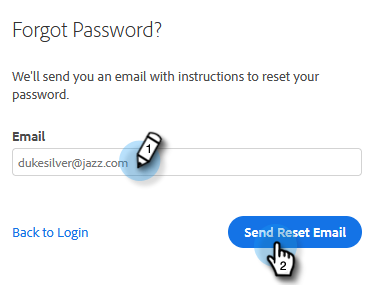

# Marketo Sales のパスワードの変更 {#change-your-marketo-sales-password}

パスワードを変更する必要がある場合、 手順は次のとおりです。

## サインイン中のパスワード変更 {#change-your-password-while-signed-in}

1. 歯車アイコンをクリックし、「**[!UICONTROL 設定]**」を選択します。

   

1. デフォルトで[!UICONTROL マイプロファイル]ページが開きます。 「[!UICONTROL アカウントの詳細]」で、「**[!UICONTROL パスワードを変更]**」チェックボックスを選択します。

   

1. 現在のパスワードを入力します。 次に、新しいパスワードを入力し、再度入力して一致することを確認します。 終了したら「**[!UICONTROL 保存]**」をクリックします。

   

>[!NOTE]
>
>パスワードは次の条件を満たす必要があります。
>
>* 9 文字以上含む
>* 大文字と小文字を混在させる
>* 数値を含める
>* 特殊文字を含める

## サインアウト中のパスワード変更 {#change-your-password-while-signed-out}

1. [Sales Connect ログイン](https://toutapp.com/login)ページに移動します。 メールアドレスを入力し、「**[!UICONTROL ログイン]**」をクリックします。

   

1. 「**[!UICONTROL パスワードを忘れた場合]**」をクリックします。

   

1. アカウントに関連付けられているメールアドレスを入力し、「**[!UICONTROL リセット用メールを送信]**」をクリックします。

   

1. アカウントの所有者がパスワードを変更することを確認するメールが送信されます。 「**[!UICONTROL パスワードをリセット]**」をクリックします。

   

   >[!NOTE]
   >
   >スパムフォルダーも必ず確認してください。このメールがスパムフォルダーに入ってしまう場合があります。

1. 新しいパスワードを入力し、確認します。 入力したら、「**[!UICONTROL パスワードを設定]**」をクリックします。

   
