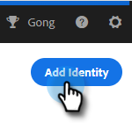

# ID を追加 {#add-identity}

送信元のメールアドレスが複数ある場合は、ID を追加します。

1. 設定アイコンをクリックします。

   

1. 「**メール設定**」をクリックします。

   

1. 「**ID を追加**」をクリックします。

   

1. 情報（E メールと名前は必須フィールド）を入力し、 **作成**.

   

1. その後、「メールアドレスを確認してください」というメールが届きます。 確認するには、 **メールアドレスを確認**.

   

Marketo Sales で電子メールを送信し、複数の ID を持っている場合、それらを切り替えることができます。

>[!NOTE]
>
>設定できる電子メール ID の数に制限はありません。

>[!MORELIKETHIS]
>
>[電子メール署名の追加または更新](/help/marketo/product-docs/marketo-sales-insight/actions/getting-started/email-settings/add-or-update-your-email-signature.md).
