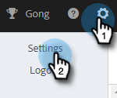
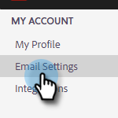
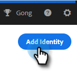
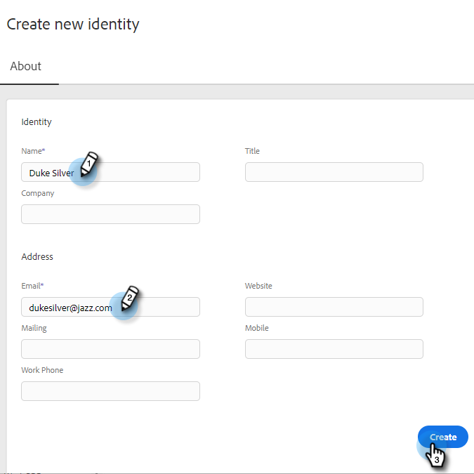
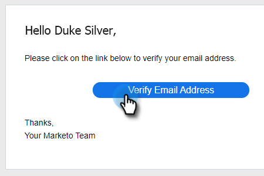

# ID を追加 {#add-identity}

送信元のメールアドレスが複数ある場合は、ID を追加します。

>[!NOTE]
>
>複数の ID の使用は、Gmail または Outlook／Exchange 配信チャネルではサポートされていません。 Gmail および Outlook／Exchange は、ユーザーレベルで認証するので、接続されたメールアドレスからのメールのみが送信されます。 異なるメールアドレスで複数の ID を使用するには、送信元のメールドメインを登録できるサードパーティ SMTP プロバイダー（メール配信チャネル）に接続する必要があります。 これにより、ユーザーは、SMTP 配信チャネルに接続して、登録されたドメインである限り、任意のメールアドレスから送信できます。

1. 設定アイコンをクリックします。

   

1. 「**[!UICONTROL メール設定]**」をクリックします。

   

1. 「**[!UICONTROL ID を追加]**」をクリックします。

   

1. 情報（メールと名前は必須フィールド）を入力し、「**[!UICONTROL 作成]**」をクリックします。

   

1. その後、「メールアドレスを確認してください」というメールが届きます。 確認するには、「**[!UICONTROL メールアドレスを確認]**」をクリックします。

   

Marketo Sales で複数の ID を使用してメールを送信する場合、切替スイッチでそれらを切り替えることができます。

>[!NOTE]
>
>設定できるメール ID の数に制限はありません。

>[!MORELIKETHIS]
>
>[メール署名の追加または更新](/help/marketo/product-docs/marketo-sales-insight/actions/getting-started/email-settings/add-or-update-your-email-signature.md)
