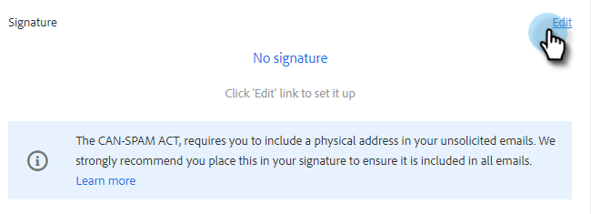
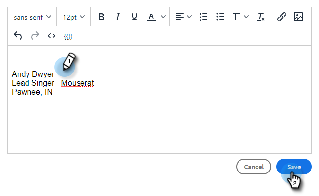

# メール署名の追加または更新 {#add-or-update-your-email-signature}

Marketo Sales からのメール送信が、自分のメールクライアントから送信する場合と同じようにシームレスなエクスペリエンスになるようにしたいと考えています。 そのための有効な方法として、メール署名を追加します。

1. 歯車アイコンをクリックし、「**[!UICONTROL 設定]**」を選択します。

   

1. [!UICONTROL マイアカウント]で、「**[!UICONTROL メール設定]**」を選択します。

   

1. 「**[!UICONTROL アドレスと署名]**」タブで、署名を作成するメール ID を選択します。

   

1. [!UICONTROL 署名]カードで、「**[!UICONTROL 編集]**」をクリックします。

   

1. 目的のテキスト（または画像）を入力し、「**[!UICONTROL 保存]**」をクリックします。

   

   >[!TIP]
   >
   >作成画面の署名が、メールクライアントに表示されている署名と同様になっていることを確認します。
