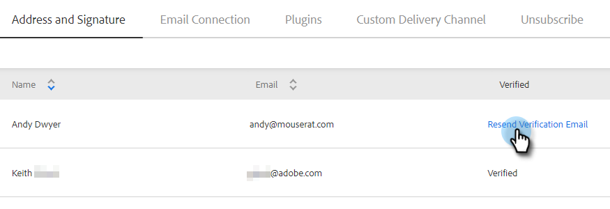

# メールを確認 {#verify-your-email}

検証されていない電子メール ID がある場合は、次の手順に従います。

1. 右上の歯車アイコンをクリックし、「 」を選択します。 **設定**.

   

1. 「マイアカウント」で、「**メール設定**」をクリックします。

   

1. 「アドレスと署名」で、確認する電子メールを探し、 **確認メールを再送信**. 新しい検証 E メールが送信されます。

   

1. クリック **再送信**.

   

1. 受信者が E メールを開き、手順に従って E メールアドレスを検証します。

   

>[!NOTE]
>
>確認 E メールが届かない場合は、スパムフォルダーを確認してください。 ない場合は、 [Marketoサポート](https://nation.marketo.com/t5/Support/ct-p/Support).
