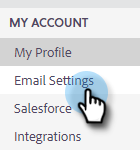
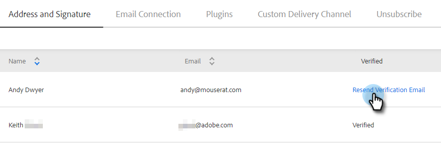

# メールの認証 {#verify-your-email}

確認されていない電子メール IDがある場合は、次の手順に従います。

1. 右上の歯車アイコンをクリックし、「**[!UICONTROL 設定]**」を選択します。

   

1. 「[!UICONTROL マイアカウント]」で、「**[!UICONTROL メール設定]**」をクリックします。

   

1. 「[!UICONTROL アドレスと署名]」で、確認するメールを探し、「**[!UICONTROL 確認用メールを再送信]**」をクリックします。 新しい確認用メールが送信されます。

   

1. 「**[!UICONTROL 再送信]**」をクリックします。

   

1. 受信者がメールを開き、手順に従ってメールアドレスを認証します。

   

>[!NOTE]
>
>確認用メールが届かない場合は、スパムフォルダーを確認してください。 存在しない場合は、[Marketo サポート ](https://nation.marketo.com/t5/Support/ct-p/Support)にお問い合わせください。
