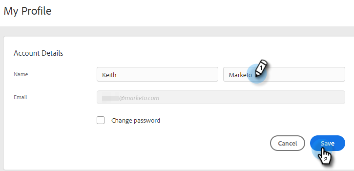

# プロファイルの管理 {#manage-your-profile}

マイプロファイルページで、名前、アカウントの言語、ロケール、タイムゾーンを更新し、パスワードを変更できます。

## アカウントの詳細 {#account-details}

ここで、名前やパスワードを更新できます。

1. 歯車アイコンをクリックし、**設定**&#x200B;を選択します。

   

1. デフォルトでマイプロファイルページが開きます。名前を更新するには、変更内容を入力し、「**保存**」をクリックします。

   

>[!NOTE]
>
>メールアドレスは表示専用に設定されています。変更が必要な場合は、[Marketo サポート](https://nation.marketo.com/t5/Support/ct-p/Support)にお問い合わせください。

このセクションでは、パスワードを変更することもできます。手順の概要はこのドキュメントで説明します。

## 連携 {#your-integrations}

ページの右側の「連携」セクションに、アカウントのすべての接続ステータスが表示されます。

>[!NOTE]
>
>Exchange On Prem をMarketo Sales と共に使用している場合、配信チャネル（最初の行項目）または返信追跡（2 番目の行項目）の統合ヘルスチェックは更新されません。 アドビは、今後のリリースでこの機能をサポートするように取り組んでいます。

## タイムゾーン {#time-zone}

アカウントの言語、ロケール、タイムゾーンの変更方法を以下に示します。

>[!NOTE]
>
>サポートされている言語：英語、フランス語、ドイツ語、日本語、ポルトガル語、スペイン語。

1. 歯車アイコンをクリックし、**設定**&#x200B;を選択します。

   

1. 言語を変更するには、「**言語**」ドロップダウンをクリックして選択します。

   

1. ロケールは、その言語が話されている地域を指します。言語を変更するとデフォルトで選択されますが、手動で変更するには、 **ロケール** 」ドロップダウンリストから選択します。

   

1. 「**タイムゾーン**」ドロップダウンをクリックして選択します。

   

1. 終了したら「**保存**」をクリックします。

   

これで完了です。
