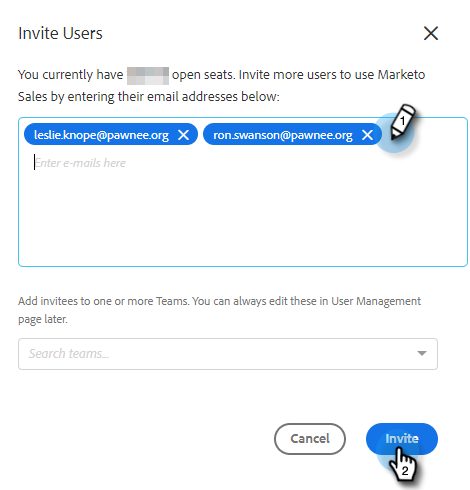

# MSI アクション管理ガイド {#msi-actions-admin-guide}

>[!PREREQUISITES]
>
>* Marketoアカウントで MSI アクションが有効になっていることをカスタマーサクセスマネージャーに確認してください (CSM をお持ちでない場合は、 [サポートに連絡](https://nation.marketo.com/t5/support/ct-p/Support)) をクリックします。
>* Marketo/Salesforce 同期を設定する必要があります。

<table>
 <tr>
  <th>ペルソナ</th>
  <th>ステップ</th>
 </tr>
 <tr>
  <td>Marketo 管理者</td>
  <td>Marketo Sales アカウントの設定</td>
 </tr>
 <tr>
  <td>Marketo Admin または  Salesforce 管理者</td>
  <td>Marketoセールスアカウントを Salesforce に接続</td>
 </tr>
 <tr>
  <td>Marketo 管理者</td>
  <td>Marketo Sales アカウントをMarketoに接続</td>
 </tr>
 <tr>
  <td>Marketo 管理者</td>
  <td>MarketoからMarketoセールスアカウントへのデータ同期の開始</td>
 </tr>
 <tr>
  <td>Marketo 管理者</td>
  <td>ユーザを MSI-Actions に招待する</td>
 </tr>
 <tr>
  <td>Salesforce 管理者</td>
  <td>Salesforce での MSI パッケージのインストール/アップグレード</td>
 </tr>
 <tr>
  <td>Salesforce 管理者</td>
  <td>Salesforce での MSI-Actions の設定</td>
 </tr>
</table>

## Marketoセールスアカウントの設定 {#set-up-marketo-sales-account}

1. Marketo で、「**管理者**」をクリックします。

   

1. クリック **Sales Insight**&#x200B;を、 **アクション設定**. 招待するMarketo管理者のリストから選択し、 **招待の送信**.

   

アカウントにアクセスする手順が記載された電子メールがユーザーに送信されます。

>[!NOTE]
>
>追加のユーザーは、Marketoからは追加されず、代わりにセールスアカウントのユーザー管理ページから追加されます。 [ここをクリック](/help/marketo/product-docs/marketo-sales-connect/admin/invite-users.md) を参照して、ユーザーの追加について確認してください。

## Marketoセールスアカウントを Salesforce に接続 {#connect-marketo-sales-account-to-salesforce}

1. Marketo Sales アカウントで、歯車アイコンをクリックし、 **設定**.

   

1. 管理設定で、**Salesforce** をクリックします。

   

1. 「接続とカスタマイズ」タブで、「**接続**」をクリックします。

   

1. 「**OK**」をクリックします。

   

既に Salesforce にログインしている場合は、連携します。 ログインしていない場合は、ログインするように求められます。

## Marketoをセールスアプリアカウントに接続 {#connect-marketo-to-your-sales-apps-account}

1. Marketo Sales アカウントで、歯車アイコンをクリックし、 **設定**.

   

1. 管理者設定で、 **Marketo**.

   

1. クリック **接続**. アカウントが接続されます。

   

>[!NOTE]
>
>接続できない場合は、資格情報をMarketo Sales Insight の「Actions Config」タブからコピーし、「設定」タブに貼り付けます。

## データ同期の開始 {#initiate-data-sync}

1. Marketo で、「**管理者**」をクリックします。

   

1. 「Sales Insight」をクリックします。

   

1. 「アクション設定」タブをクリックします。 「アクションフィールドの同期」カードで、 **同期**.

   

1. 同期されるフィールドのプレビューが表示されます。 「**同期の開始**」をクリックします。

   

Marketoと Salesforce に存在する担当者レコードは、Marketoセールスアプリアカウントと同期されます。

## 個々のユーザを MSI アクションに招待する {#invite-individual-users-to-msi-actions}

1. Marketo Sales アカウントで、歯車アイコンをクリックし、 **設定**.

   

1. 「管理者設定」で、「 **ユーザー管理**.

   

1. クリック **アクション** を選択し、 **ユーザーの招待**.

   

1. 電子メールアドレスを入力し、 **招待**.

   

>[!NOTE]
>
>デフォルトでは、すべての新規メンバーが全員チームに追加されます。

確認メッセージが表示されます。

## CSV 経由で MSI アクションにユーザを招待する {#invite-users-via-csv-to-msi-actions}

1. Marketo Sales アカウントで、歯車アイコンをクリックし、 **設定**.

   

1. 「管理者設定」で、「 **ユーザー管理**.

   

1. クリック **アクション** を選択し、 **CSV でユーザーを招待**.

   

1. コンピューター上の CSV を参照し、選択して、 **次へ**.

   

1. フィールドが正しくマッピングされていることを確認し、 **招待**.

   

招待が送信されると、確認メッセージが表示されます。

>[!NOTE]
>
>これが完了したら、既存の MSI パッケージをアップグレードするか、新しいパッケージをインストールして、次の手順に進みます。 [Salesforce での MSI アクションの設定](/help/marketo/product-docs/marketo-sales-insight/actions/salesforce-configuration/msi-actions-configuration-in-salesforce.md).
