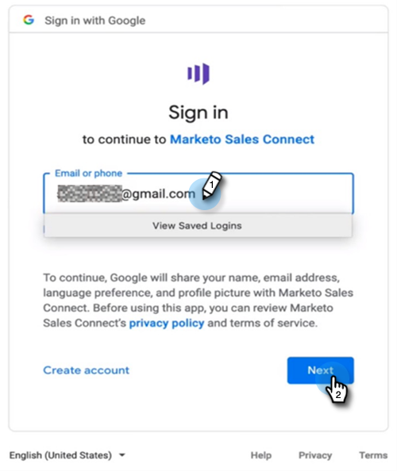

# MSI アクションユーザオンボーディングガイド {#msi-actions-user-onboarding-guide}

>[!PREREQUISITES]
>
>* 管理者は、MSI-Actions を使用し始めるようにユーザーを招待する必要があります。
>* Salesforce でアカウントを有効化するには、Salesforce プロファイル権限で「API 有効」にする必要があります。

新規ユーザーは、次の手順に従う必要があります。

1. お知らせメールで、 **はじめに**.

   

1. クリック **Salesforce でアカウントを有効化**.

   

1. 既に Salesforce アカウントにログインしている場合は、次の画面に自動的に移動します。 ログインしていない場合は、今すぐログインしてください。

   

>[!NOTE]
>
>Salesforce メール ID とセールスアカウントメール ID は同じである必要があります。

1. クリック **許可**.

   

1. クリック **開始**.

   

1. 「**次へ**」をクリックします。

   

1. 使用するメールクライアント（Gmail または Outlook）を選択し、 **次へ**.

   

1. メールアドレスを入力し、 **次へ**.

   

1. パスワードを入力し、 **次へ**.

   

1. クリック **続行**.

   

>[!NOTE]
>
>Outlook を選択すると、Outlook 認証画面が表示され、メールアドレスを入力します。

1. 「メール接続の設定」成功メッセージが表示され、次の画面に送信されます。

   

1. カスタム署名を入力し、 **保存** ( 後でプロファイルページからこれをおこなう場合は、 **スキップ**) をクリックします。

   

1. 「**終了**」をクリックします。

   

1. Marketo Sales Actions の簡単な紹介を表示するオプションが表示されます。 クリック **次へ** 表示する、または **今は利用できません** 後で保存する場合。

   

1. ツアーが完了した場合、またはスキップした場合は、Web アプリケーションに直接ログインするか、MSI パネルからすべての機能にアクセスできる Salesforce アカウントに直接ログインするかを選択します ( この例では、 **Salesforce を起動**) をクリックします。

   

1. Salesforce（クラシックまたは Lightning）内では、任意のリード、連絡先、アカウント、商談に移動できます。 MSI パネルのドロップダウンからすべてのセールスアクションを使用できます。

   
