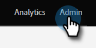
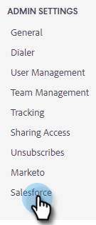
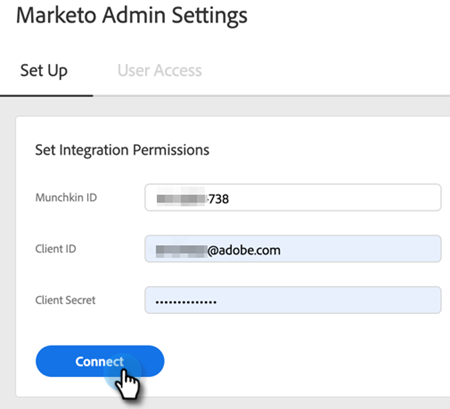

# Sales Insight Actions 管理者設定ガイド {#sales-insight-actions-admin-setup-guide}

>[!NOTE]
>
>Marketo Sales Insight Actions は、[Marketo Sales Insight パッケージ](/help/marketo/product-docs/marketo-sales-insight/msi-for-salesforce/installation/install-marketo-sales-insight-package-in-salesforce-appexchange.md){target="_blank"}を使用して Salesforce CRM と排他的に統合された、web ベースのアプリケーションです。「Marketo Sales」や、シンプルに「Actions」と呼ばれることもあります。

>[!PREREQUISITES]
>
>* Marketo Engage アカウントに対して MSI アクションが有効になっていることを、Adobe アカウントチーム（アカウントマネージャー）に確認します（アカウントマネージャーがない場合は、[Marketo サポート ](https://nation.marketo.com/t5/support/ct-p/Support){target="_blank"} にお問い合わせください）。
>* Marketo と Salesforce の同期を設定する必要があります。

<table>
 <tr>
  <th>ペルソナ</th>
  <th>ステップ</th>
 </tr>
 <tr>
  <td>Marketo 管理者</td>
  <td>Marketo Sales アカウントの設定</td>
 </tr>
 <tr>
  <td>Marketo管理者または  [!DNL Salesforce] 管理者</td>
  <td>Marketo Sales アカウントの接続先 [!DNL Salesforce]</td>
 </tr>
 <tr>
  <td>Marketo 管理者</td>
  <td>Marketo Sales アカウントを Marketo に接続</td>
 </tr>
 <tr>
  <td>Marketo 管理者</td>
  <td>Marketo から Marketo Sales アカウントへのデータ同期の開始</td>
 </tr>
 <tr>
  <td>Marketo 管理者</td>
  <td>ユーザーを MSI-Actions に招待する</td>
 </tr>
 <tr>
  <td>[!DNL Salesforce] 管理</td>
  <td>での MSI パッケージのインストールまたはアップグレード [!DNL Salesforce]</td>
 </tr>
 <tr>
  <td>[!DNL Salesforce] 管理</td>
  <td>での MSI アクションの設定 [!DNL Salesforce]</td>
 </tr>
</table>

## Marketo Sales アカウントの設定 {#set-up-marketo-sales-account}

1. Marketo で、「**[!UICONTROL 管理者]**」をクリックします。

   

   >[!NOTE]
   >
   >統合情報カードにクライアント ID およびクライアントシークレットが表示されていない場合、最初のユーザーを招待して Actions インスタンスを有効化することで、クライアント ID およびクライアントシークレットが表示されます。

1. 「**Sales Insight**」をクリックし、「**Actions 設定**」をクリックします。Marketo 管理者のリストから選択し、「**招待を送信**」をクリックして招待します。

   

アカウントにアクセスする手順が記載されたメールがユーザーに送信されます。

>[!NOTE]
>
>追加のユーザーは、Marketo からは追加されず、代わりに Sales アカウントのユーザー管理ページから追加されます。ユーザーの追加について詳しくは、[こちらをクリック](/help/marketo/product-docs/marketo-sales-connect/admin/invite-users.md){target="_blank"}してください。

## Marketo営業アカウントの [!DNL Salesforce] への接続 {#connect-marketo-sales-account-to-salesforce}

1. Marketo Sales アカウントで、歯車アイコンをクリックし、「**[!UICONTROL 設定]**」を選択します。

   

1. [!UICONTROL &#x200B; 管理者設定 &#x200B;] で、**[!UICONTROL Salesforce]** をクリックします。

   

1. [[!UICONTROL &#x200B; 接続とカスタマイズ &#x200B;]] タブで、[**[!UICONTROL 接続]**] をクリックします。

   

1. 「**[!UICONTROL OK]**」をクリックします。

   

既に Salesforce にログインしている場合は、Salesforce に接続されます。まだログインしていない場合は、ログインするように求められます。

## Marketo をセールスアプリアカウントに接続 {#connect-marketo-to-your-sales-apps-account}

1. Marketo Sales アカウントで、歯車アイコンをクリックし、「**[!UICONTROL 設定]**」を選択します。

   

1. [!UICONTROL &#x200B; 管理者設定 &#x200B;] で、**Marketo** をクリックします。

   

1. 「**[!UICONTROL 接続]**」をクリックします。アカウントが接続されます。

   

>[!NOTE]
>
>接続できない場合は、Marketo Sales Insight の「Actions 設定」タブから資格情報をコピーし、「設定」タブにペーストします。

## データ同期の開始 {#initiate-data-sync}

Sales Insight Actions のデータ統合フィールド同期により、Insight データベースからMarketo Engage Actions データベースにユーザー情報を取り込み、ユーザーのデータを最新の状態に保ち、Marketoと [!DNL Salesforce] 全体で適切なレコードにアクティビティを確実に記録することができます。

>[!CAUTION]
>
>データ同期を開始したら、Sales Insight Actions インスタンスから元のユーザーを&#x200B;**削除しない**&#x200B;ようにします。これは、最初の招待が送信されたユーザーです。

1. Marketo で、「**[!UICONTROL 管理者]**」をクリックします。

   

1. 「**[!UICONTROL Sales Insight]**」をクリックします。

   

1. 「**[!UICONTROL Actions 設定]**」タブをクリックします。「アクションフィールドを同期」カードで、「**[!UICONTROL 同期]**」をクリックします。

   

1. 同期されるフィールドのプレビューが表示されます。「**[!UICONTROL 同期の開始]**」をクリックします。

   

Marketoと [!DNL Salesforce] に存在する人物レコードは、Marketo Sales Apps アカウントに同期されます。

>[!NOTE]
>
>Sales Insight Actions、Marketo、Salesforce 間の人物とアクティビティのデータ同期について詳しくは、[こちらをクリック](/help/marketo/product-docs/marketo-sales-insight/actions/admin/sync-sales-action-data-with-marketo-and-salesforce.md){target="_blank"}してください。

## 個々のユーザーを MSI Actions に招待する {#invite-individual-users-to-msi-actions}

1. Marketo Sales アカウントで、歯車アイコンをクリックし、「**[!UICONTROL 設定]**」を選択します。

   

1. [!UICONTROL &#x200B; 管理設定 &#x200B;] で、「**[!UICONTROL User Management]**」を選択します。

   

1. 「**[!UICONTROL Actions]**」をクリックし、「**[!UICONTROL ユーザーを招待する]**」を選択します。

   

1. メールアドレスを入力し、「**[!UICONTROL 招待する]**」をクリックします。

   

>[!NOTE]
>
>デフォルトでは、すべての新規メンバーが全員チームに追加されます。

確認メッセージが表示されます。

## CSV 経由で MSI Actions にユーザーを招待する {#invite-users-via-csv-to-msi-actions}

1. Marketo Sales アカウントで、歯車アイコンをクリックし、「**[!UICONTROL 設定]**」を選択します。

   

1. [!UICONTROL &#x200B; 管理設定 &#x200B;] で、「**[!UICONTROL User Management]**」を選択します。

   

1. 「**[!UICONTROL Actions]**」をクリックし、「**[!UICONTROL CSV 経由でユーザーを招待する]**」を選択します。

   

1. PC 上の CSV ファイルを参照して選択し、「**[!UICONTROL 次へ]**」をクリックします。

   

1. フィールドが正しくマッピングされていることを確認し、「**[!UICONTROL 次へ]**」をクリックします。

   

招待が送信されると、確認メッセージが表示されます。

>[!NOTE]
>
>これが完了したら、既存の MSI パッケージをアップグレードするか、新しいパッケージをインストールして、[Salesforce での MSI Actions の設定](/help/marketo/product-docs/marketo-sales-insight/actions/crm/salesforce-package-configuration/sales-insight-actions-configuration-in-salesforce.md){target="_blank"}に進みます。
