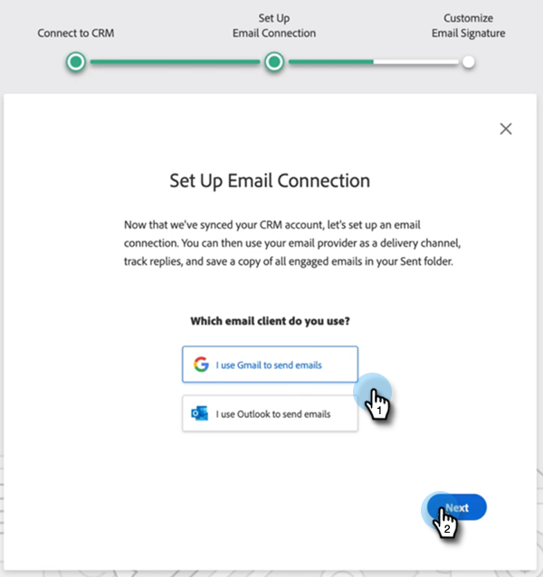

# Sales Insight Actions ユーザーオンボーディングガイド {#sales-insight-actions-user-onboarding-guide}

>[!NOTE]
>
>Marketo Sales Insight Actions は、[Marketo Sales Insight パッケージ](/help/marketo/product-docs/marketo-sales-insight/msi-for-salesforce/installation/install-marketo-sales-insight-package-in-salesforce-appexchange.md){target="_blank"}を使用して Salesforce CRM と排他的に統合された、web ベースのアプリケーションです。「Marketo Sales」や、シンプルに「Actions」と呼ばれることもあります。

>[!PREREQUISITES]
>
>* 管理者は、MSI Actions を使用し始めるようにユーザーを招待する必要があります。
>* [!DNL Salesforce] でアカウントを有効にするには、[!DNL Salesforce] プロファイルの権限で「API が有効になっている」必要があります。

新規ユーザーは、以下の手順に従う必要があります。

1. ウェルカムメールで、「**[!UICONTROL 開始する]**」をクリックします。

   

1. 「**[!UICONTROL Salesforce でアカウントをアクティベート]**」をクリックします。

   

1. 既に [!DNL Salesforce] アカウントにログインしている場合は、自動的に次の画面に移動します。 ログインしていない場合は、今すぐログインしてください。

   

>[!NOTE]
>
>[!DNL Salesforce] の電子メール ID と営業アカウントの電子メール ID は同じである必要があります。

1. 「**[!UICONTROL 許可]**」をクリックします。

   

1. 「**[!UICONTROL 開始]**」をクリックします。

   

1. 「**[!UICONTROL 次へ]**」をクリックします。

   

1. 使用するメールクライアント（Gmail または [!DNL Outlook]）を選択し、「**[!UICONTROL 次へ]**」をクリックします。

   

1. メールアドレスを入力し、「**[!UICONTROL 次へ]**」をクリックします。

   

1. パスワードを入力し、「**[!UICONTROL 次へ]**」をクリックします。

   

1. 「**[!UICONTROL 続行]**」をクリックします。

   

>[!NOTE]
>
>Outlook を選択した場合、Outlook 認証画面が表示され、メールアドレスを入力します。

1. メール接続の設定成功メッセージが表示され、次の画面に移動します。

   

1. カスタム署名を入力し、「**[!UICONTROL 保存]**」（後でプロファイルページから行う場合は、「**[!UICONTROL スキップ]**」）をクリックします。

   

1. 「**[!UICONTROL 終了]**」をクリックします。

   

1. Marketo Sales Actions の簡単な紹介を表示するオプションが表示されます。「**[!UICONTROL 次へ]**」をクリックして表示するか、後で確認する場合は、「**[!UICONTROL 後で]**」をクリックします。

   

1. ツアーが終了した場合、またはスキップした場合は、MSI パネルからすべての機能にアクセスできる Web アプリケーションまたは [!DNL Salesforce] アカウントに直接ログインするかどうかを選択します（この例では **[!UICONTROL 「Salesforceを起動]**」を選択します）。

   

1. [!DNL Salesforce] （Classic または Lightning）内では、任意のリード、連絡先、アカウント、オポチュニティに移動できます。 MSI パネルのドロップダウンからすべての Sales Actions を使用できます。

   
