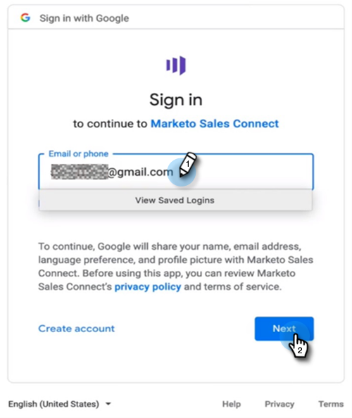

# Sales Insight Actions ユーザオンボーディングガイド {#sales-insight-actions-user-onboarding-guide}

>[!PREREQUISITES]
>
>* 管理者は、MSI アクションを使用し始めるようにユーザを招待する必要があります。
>* Salesforce でアカウントをアクティベートするには、Salesforce プロファイル権限で「API 有効」にする必要があります。

新規ユーザは、次の手順に従う必要があります。

1. ようこそメールで、「**開始する**」をクリックします。

   

1. 「**Salesforce でアカウントをアクティベート**」をクリックします。

   

1. 既に Salesforce アカウントにログインしている場合は、次の画面に自動的に移動します。ログインしていない場合は、今すぐログインしてください。

   

>[!NOTE]
>
>Salesforce メール ID とセールスアカウントメール ID は同じである必要があります。

1. 「**許可**」をクリックします。

   

1. 「**開始**」をクリックします。

   

1. 「**次へ**」をクリックします。

   

1. 使用するメールクライアント（Gmail または Outlook）を選択し、「**次へ**」をクリックします。

   

1. メールアドレスを入力し、「**次へ**」をクリックします。

   

1. パスワードを入力し、「**次へ**」をクリックします。

   

1. 「**続行**」をクリックします。

   

>[!NOTE]
>
>Outlook を選択した場合、Outlook 認証画面が表示され、メールアドレスを入力します。

1. メール接続の設定成功メッセージが表示され、次の画面に移動します。

   

1. カスタム署名を入力し、「**保存**」（後でプロファイルページから行う場合は、「**スキップ**」）をクリックします。

   

1. 「**終了**」をクリックします。

   

1. Marketo Sales のアクションの簡単な紹介を表示するオプションが表示されます。「**次へ**」をクリックして表示するか、後で確認する場合は、「**後で**」をクリックします。

   

1. ツアーが完了またはツアーをスキップしたら、web アプリケーションに直接ログインするか、MSI パネルからすべての機能にアクセスできる Salesforce アカウントに直接ログインするかを選択します（この例では、**Salesforce を起動**&#x200B;を選択します）。

   

1. Salesforce（Classic または Lightning）内では、任意のリード、取引先責任者、アカウント、商談に移動できます。MSI パネルのドロップダウンからすべてのセールスアクションを使用できます。

   
