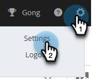
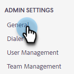
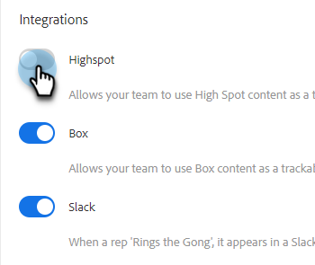
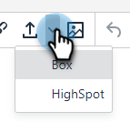
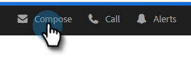
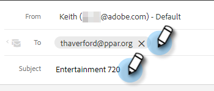
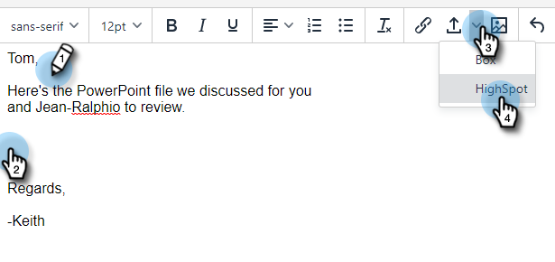
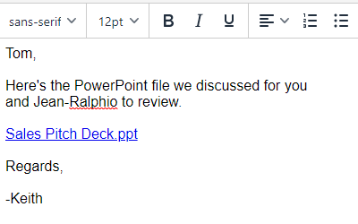
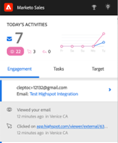

# Highspot との統合 {#highspot-integration}

セールスチームは、セールスインサイトアクションから Highspot 機能にアクセスし、セールスサイクル全体を通じて、より優れた可視性、効率性、パフォーマンスを実現できます。セールスインサイトアクションユーザは、Highspot とセールスインサイトアクション内のコンテンツ追跡と分析をキャプチャしながら、Highspot のセールスイネーブルメントプラットフォームに保存されたセールスコンテンツを選択し、メール、メールテンプレート、セールスキャンペーンに直接挿入できます。

## Highspot 統合を有効にする {#enabling-highspot-integration}

>[!NOTE]
>
>セールスインサイトアクションインスタンスの Highspot を有効にするには、管理者権限が必要です。

1. 歯車アイコンをクリックし、「**設定**」を選択します。

   

1. 「**管理者設定**」で「**一般**」を選択します。

   

1. スクロールして「**統合**」カードをクリックし、スライダーをクリックして Highspot を有効にします。

   

作成ウィンドウ、テンプレートエディター、キャンペーンメールエディターでコンテンツのアップロードボタンを選択する際に、「Highspot」を選択するオプションが表示されるようになりました。

## Highspot コンテンツへのアクセスとメールによるコンテンツの共有 {#accessing-highspot-content}

Highspot にアクセスし、セールスインサイトアクションの作成ウィンドウ、テンプレートエディター、セールスキャンペーンメールエディターからメールにコンテンツを追加します。作成ウィンドウからコンテンツにアクセスする手順を以下に示します。

1. メールの下書きを作成します（複数の方法があります。この例では、ヘッダーの「**作成**」を選択しています）。

   

1. 「宛先」フィールドに入力し、「件名」を入力します。

   

1. メッセージを書きます。Highspot コンテンツを挿入するメール内のスポットをクリックします。画像アイコンの横にある矢印ドロップダウンをクリックし、「**Highspot**」を選択します。

   

1. Highspot アカウントにログインします（まだログインしていない場合）。

   

1. 目的のコンテンツを選択し、「**コンテンツを追加**」ボタンをクリックします。

   

   >[!TIP]
   >
   >目的のコンテンツが素早く表示されない場合は、上部の検索バーを使用します。

   コンテンツはメール内にリンクとして表示されます。受信者は、リンクをクリックして、そのリンクを表示またはダウンロードできます。

   

## Highspot コンテンツでのクリックの追跡 {#tracking-clicks-on-highspot-content}

受信者が送信したコンテンツを開くと、ライブフィードで通知が送信されます。アクティビティは、コンテンツリンクの詳細と共に、クリックとして表示されます。また、コンテンツの表示とダウンロードが Highspot で追跡されます。

