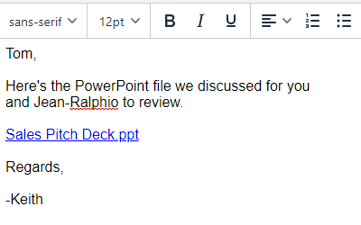

# Highspot 統合 {#highspot-integration}

セールスは、Sales Insight Actions から Highspot 機能にアクセスし、セールス・サイクル全体を通じて、より優れた可視性、効率性、パフォーマンスを実現します。 Sales Insight Action ユーザーは、Highspot と Sales Insight Actions 内のコンテンツ追跡と分析をキャプチャしながら、Highspot のセールスイネーブルメントプラットフォームに保存されたセールスコンテンツを選択し、メール、メールテンプレート、セールスキャンペーンに直接挿入できます。

## Highspot 統合の有効化 {#enabling-highspot-integration}

>[!NOTE]
>
>Sales Insight アクションインスタンスの Highspot を有効にするには、管理者権限が必要です。

1. 設定を選択

PICC

1. サイドバーで一般設定を選択

PICC

1. 統合カードにスクロールし、Highspot を有効にします。

PICC

1. 作成ウィンドウ、テンプレートエディター、キャンペーン E メールエディターでコンテンツのアップロードボタンを選択する際に、「Highspot」を選択するオプションが表示されるようになりました。

PICC

## Highspot コンテンツへのアクセスとメールによるコンテンツの共有 {#accessing-highspot-content}

Highspot にアクセスし、Sales Insight アクションの作成ウィンドウ、テンプレートエディタ、セールスキャンペーンメールエディタからメールにコンテンツを追加します。 作成ウィンドウからコンテンツにアクセスする手順を以下に示します。

1. メールの下書きを作成します（複数の方法があります。この例では、ヘッダーの「**作成**」を選択しています）。

   

1. 「宛先」フィールドに入力し、「件名」を入力します。

   

1. メッセージを書きます。Highspot コンテンツを挿入するメール内のスポットをクリックします。画像アイコンの横にある矢印ドロップダウンをクリックし、「**Highspot**」を選択します。

   

1. Highspot アカウントにログインします。

   

1. 目的のコンテンツを選択し、「**コンテンツを追加**」ボタンをクリックします。

   

   >[!TIP]
   >
   >目的のコンテンツが素早く表示されない場合は、上部の検索バーを使用します。

   コンテンツはメール内にリンクとして表示されます。受信者は、リンクをクリックして、そのリンクを表示またはダウンロードできます。

   

## Highspot コンテンツでのクリックの追跡 {#tracking-clicks-on-highspot-content}

受信者が送信したコンテンツを開くと、ライブフィードで通知が送信されます。 アクティビティは、コンテンツリンクの詳細と共に、クリックとして表示されます。 また、コンテンツとダウンロードの視聴が Highspot で追跡されます。

