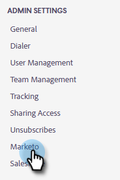

# ユーザに Marketo のアクセス権を付与 {#grant-marketo-access-to-users}

この記事の手順に従って、Sales Insight Actions ユーザに、Marketo に接続するアクセス権を付与します。これにより、ライブフィードの注目のアクションなどの機能が解放され、マーケティングキャンペーンにアクセスできるようになります。

ユーザが（Sales Insight Actions の）Marketo／チームアクセスページに表示されるには、ユーザを [Sales Insight Actions](/help/marketo/product-docs/marketo-sales-insight/actions/admin/invite-users-and-admins.md#invite-users) に招待する必要があります。そこで、Marketo 接続へのアクセス権が付与されます。

>[!CAUTION]
>
>Sales Insight Actions を Marketo に接続し、10 分待ってから、以下の手順を実行してください。

1. 歯車アイコンをクリックし、「**設定**」を選択します。

   

1. 「管理者設定」で、「**Marketo**」をクリックします。

   

1. 「**ユーザアクセス**」タブをクリックします。1 人または複数のユーザを選択し、「**接続**」をクリックします。

   

   >[!NOTE]
   >
   >ユーザにアクセス権を付与する際に 1 回だけ、ワークスペースの割り当てを実行できます。設定後、ユーザを変更するには、ユーザの接続を解除する必要があります。

1. Marketo サブスクリプションでワークスペースが有効になっている場合、ワークスペースを各ユーザまたは一連のユーザに一括で割り当てることができます。ワークスペースが選択されていない場合は、デフォルトの Marketo ワークスペースに割り当てます。

   

   **オプションの手順**：「ワークスペース」ドロップダウンをクリックして、目的のワークスペースを選択します。

   

1. 「**接続**」をクリックします。

   

チーム管理ページからさらにユーザを追加し、上記の手順に従ってユーザを接続させることができます。
