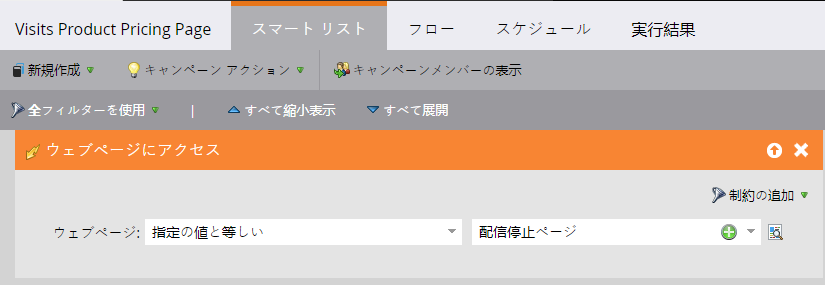
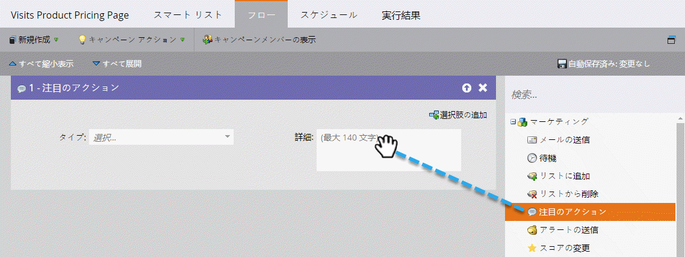
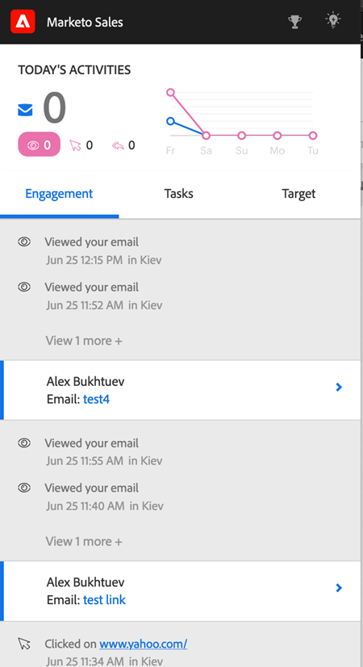

# Sales Insight Actions での注目のアクション {#interesting-moments-in-sales-insight-actions}

注目のアクションは、Marketo Sales Insight Actions を通じてセールスチームとコミュニケーションを取るための鍵となります。

## 注目のアクションとは何でしょうか。 {#what-is-an-interesting-moment}

それは、あなた次第です。どんな情報がセールスチームに関係あるのかを自分で決定します。セールスチームがリードについて知りたいのは、例えば次のようなことです。

* Web サイトの価格設定ページへのアクセス
* 新製品発表メールに記載されたリンクをクリック
* 製品デモをリクエスト

## 注目のアクションを作成する方法 {#how-do-i-create-an-interesting-moment}

1. [スマートキャンペーン](/help/marketo/product-docs/core-marketo-concepts/smart-campaigns/understanding-smart-campaigns.md){target=&quot;_blank&quot;}を選択します。トリガーされた場合にセールスチームが興味を持つものがいいでしょう。

   

1. **注目のアクション**&#x200B;フローステップをドラッグします。

   

1. **タイプ**&#x200B;を選択します（メール、マイルストーン、web）。

   

1. このアクションが重要である理由として、セールスチームへのメッセージを「**説明**」フィールドに記入します。

   

   >[!NOTE]
   >
   >注目のアクションが発生した日付と、追加された経緯（リードアクション > フローステップ > SOAP API など）も Marketo によって記録されます。

## 注目のアクションは、Marketo でどのように表示されるか  {#what-does-an-interesting-moment-look-like-in-marketo}

注目のアクションは、[リードのアクティビティログ](/help/marketo/product-docs/core-marketo-concepts/smart-lists-and-static-lists/managing-people-in-smart-lists/using-the-person-detail-page.md){target=&quot;_blank&quot;}に表示されます。

## 注目のアクションは、Sales Insight Actions でどのように表示されるか {#what-does-an-interesting-moment-look-like-in-sales-insight-actions}

注目のアクションは、ユーザのライブフィードにリアルタイムで表示されます。Salesforce のリード所有者 ID を利用して、ユーザが所有する関連リードの注目のアクションを表示します。リード名の横にあるドロップダウンをクリックすると、電子メール、電話、販売キャンペーンでリードを素早くフォローアップできます。

