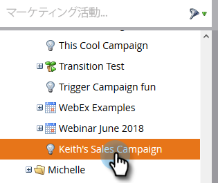
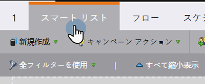
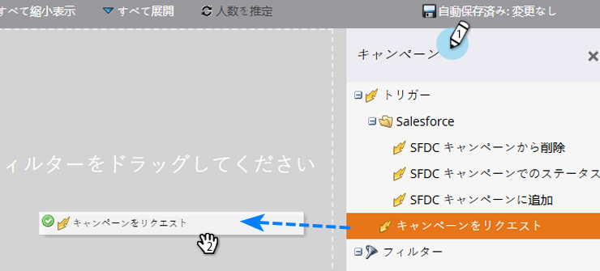
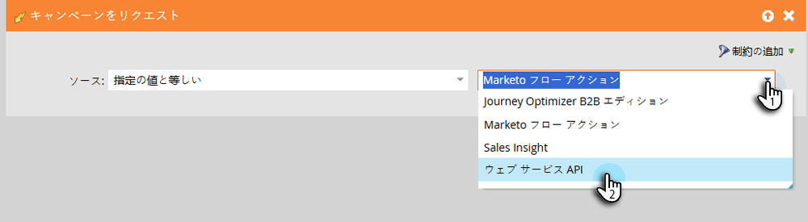
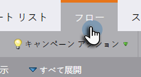
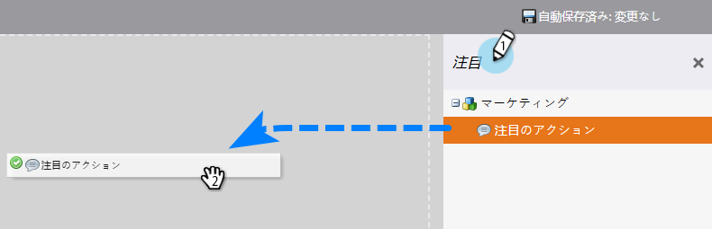
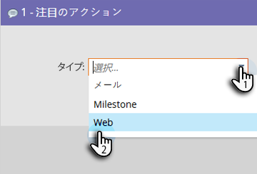
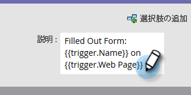
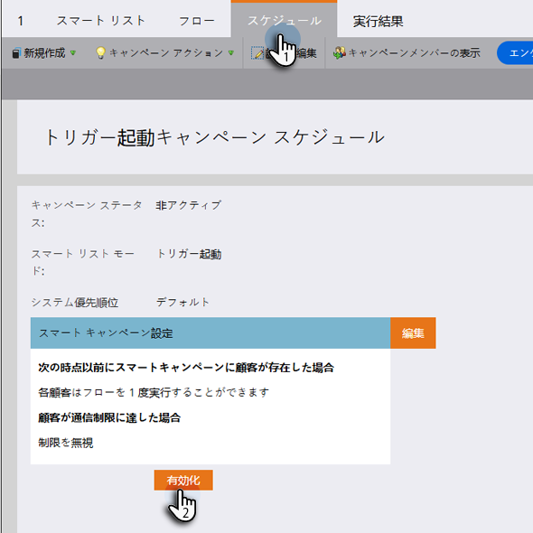

# セールスインサイトアクションにマーケティングキャンペーンを表示 {#make-a-marketing-campaign-visible-in-sales-insight-actions}

キャンペーンは、表示されている場合にのみ共有できます。

セールスインサイトアクションを使用すると、ユーザは toutapp.com という新しいセールスアプリにアクセスできます。 このアプリは新しいアクション機能セットを提供しますが、コアバージョンのセールスインサイトで使用できる&#x200B;_マーケティングキャンペーンに追加_&#x200B;機能も継承します。 マーケティングキャンペーンに追加機能へのアクセスをユーザに許可する場所（toutapp.com または MSI SFDC パッケージエクスペリエンス）に応じて、Marketo キャンペーンを異なる方法で設定する必要があるので、この点に留意することが重要です。 詳しくは、手順 4 のメモを参照してください。

1. 共有するキャンペーンを選択（または作成）します。

   

1. 「**スマートリスト**」タブをクリックします。

   

1. 「_キャンペーンをリクエスト_」トリガーに追加します。

   

1. ソースには、「is」「**Web サービス API**」を選択します。

   

   >[!NOTE]
   >
   >toutapp.com web アプリから&#x200B;_マーケティングキャンペーンに追加_&#x200B;を利用しているユーザにマーケティングキャンペーンを表示する場合（Marketo Sales Outbox オブジェクト経由で CRM に web アプリを埋め込んでいる場合も含まれます）、キャンペーンリクエストソースを「Web サービス API」に設定します。 ユーザーが Salesforce の MSI パネルで、リード、取引先責任者、アカウントのページ上のアクションや、リードおよび取引先責任者リストビューの一括アクションボタンを使用したときにマーケティングキャンペーンを表示したい場合は、キャンペーンリクエストソースを「セールスインサイト」に更新します。

1. 「**フロー**」タブをクリックします。

   

1. _注目のアクション_&#x200B;フローアクションを追加します。

   

1. タイプには、「**Web**」を選択します。

   

1. _説明_&#x200B;ボックスに、セールスチームにメッセージを書き込みます。 この例では、トークンを使用して、入力されたフォームを指定します。

   

1. 「**スケジュール**」タブをクリックし、キャンペーンを&#x200B;**アクティベート**&#x200B;します。

   
