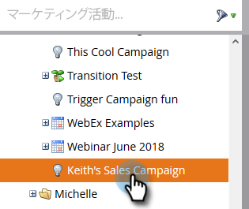
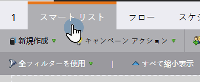
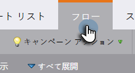
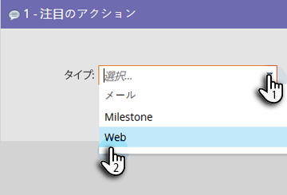
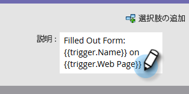

# 販売インサイトアクション UI でマーケティングキャンペーンを表示 {#make-a-marketing-campaign-visible-in-the-sales-insight-actions-ui}

キャンペーンは、表示可能になっている場合にのみ共有できます。

Sales Insight Actions を使用すると、ユーザーはtoutapp.comという新しい販売アプリにアクセスできます。 このアプリは、新しいアクション機能セットを提供するだけでなく、コアバージョンの Sales Insights で使用可能な _マーケティングキャンペーンに追加_ 機能も継承します。 ユーザーがマーケティングキャンペーンに追加機能（toutapp.comまたは MSI SFDC パッケージエクスペリエンス）にアクセスする場所に応じて、Marketo キャンペーンを別の方法で設定する必要があるので、この点に留意することが重要です。 詳しくは、手順 4 のメモを参照してください。

1. 共有するキャンペーンを選択（または作成）します。

   

1. 「**スマートリスト**」タブをクリックします。

   

1. 「キャンペーンをリクエスト」トリガーに追加します。

   

1. ソースには、「is」「**Web サービス API**」を選択します。

   

   >[!NOTE]
   >
   >toutapp.com web アプリから _マーケティングキャンペーンに追加_ を使用しているユーザーにマーケティングキャンペーンを表示する場合（これは、web アプリをMarketo Sales Outbox オブジェクト経由で CRM に埋め込んでいる場合も含みます）、「Web サービス API」に設定します。 Salesforceの MSI パネルのリード、連絡先、アカウントページ、またはリードビューと連絡先リストビューの一括アクションボタンでユーザーがアクションを使用した場合にマーケティングキャンペーンを表示するには、「Sales Insight」に更新します

1. 「**フロー**」タブをクリックします。

   

1. 注目のアクションフローアクションを追加します。

   

1. タイプには、「**Web**」を選択します。

   

1. 説明ボックスに、セールスチームにメッセージを書き込みます。この例では、トークンを使用して、入力されたフォームを指定します。

   

1. 「**スケジュール**」タブをクリックし、キャンペーンを&#x200B;**アクティベート**&#x200B;します。

   
