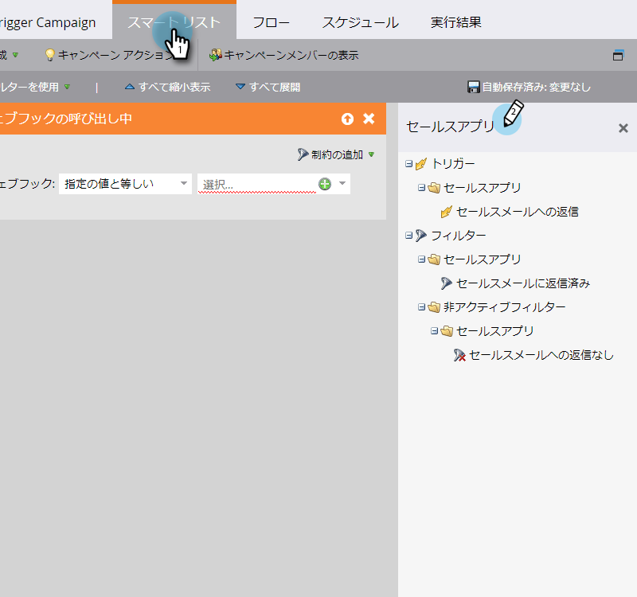
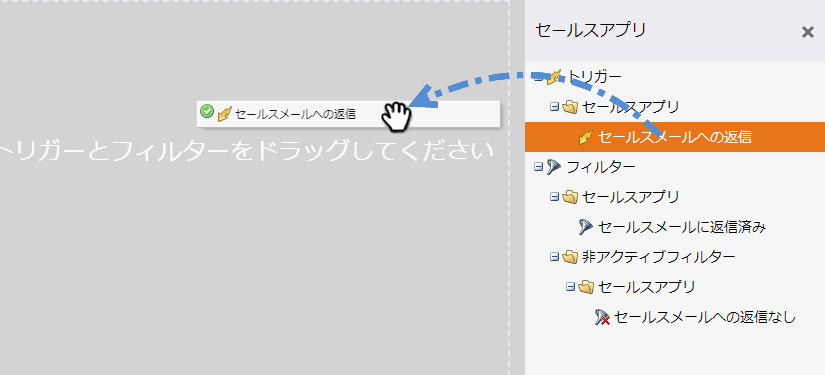
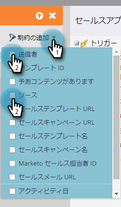

# セールスアクティビティのトリガーとフィルター {#sales-activity-triggers-and-filters}

セールスチームとのエンゲージメントの調整や、バイヤージャーニーを通じた顧客との関わり方をより深く把握したい場合は、Marketoのセールスアクティビティのインサイトが役立ちます。

スマートキャンペーンでセールスアクティビティのフィルターとトリガーを利用する方法を学ぶには、以下の手順に従います。

1. 目的のスマートキャンペーンを見つけて選択します。

   

1. 内 **スマートリスト** タブで、「Sales Apps」を検索します。

   

1. 目的のフィルターまたはトリガーを選択し、ドラッグします。

   

1. 任意の拘束を選択します。

   

>[!NOTE]
>
>アクティビティ、制約、定義の完全なリストについては、 [Sales Insight アクションアクティビティの用語集](/help/marketo/product-docs/marketo-sales-insight/actions/marketo/sales-insight-actions-activity-glossary.md).
