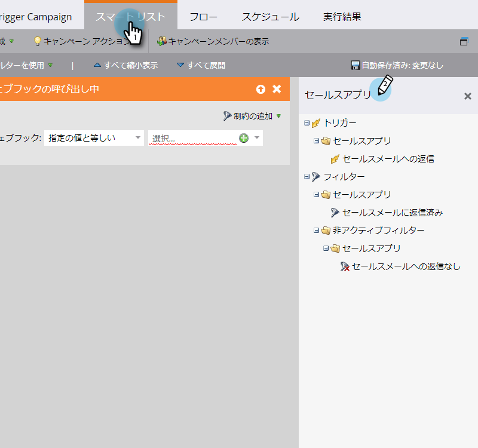
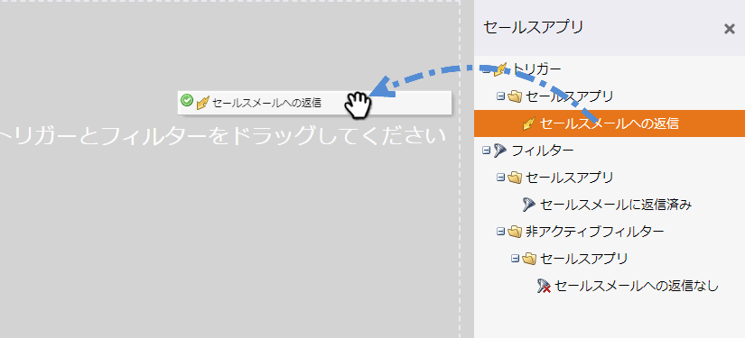
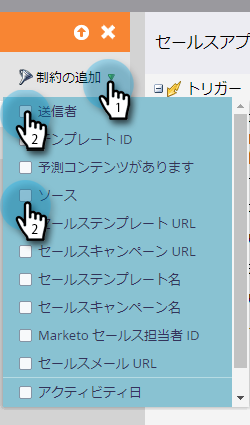

# セールスアクティビティのトリガーとフィルター {#sales-activity-triggers-and-filters}

セールスチームとのエンゲージメントの調整や、バイヤージャーニーを通じた顧客との関わり方をより深く把握したい場合は、Marketo のセールスアクティビティインサイトが役立ちます。

スマートキャンペーンでセールスアクティビティのフィルターとトリガーを利用する方法を理解する手順は以下のとおりです。

1. 目的のスマートキャンペーンを見つけて選択します。

   

1. 「**[!UICONTROL スマートリスト]**」タブで、「[!UICONTROL セールスアプリ]」を検索します。

   

1. 目的のフィルターまたはトリガーを選択し、ドラッグします。

   

1. 任意の制約を選択します。

   

>[!NOTE]
>
>アクティビティ、制約、定義の完全なリストについて詳しくは、[[!DNL Sales Insight Actions]  アクティビティ用語集](/help/marketo/product-docs/marketo-sales-insight/actions/marketo/sales-insight-actions-activity-glossary.md)を参照してください。
