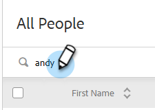
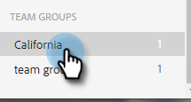

# グループの管理 {#manage-groups}

[!DNL Sales Insight Actions] でグループを管理する方法を説明します。

## グループタイプ {#group-types}

<table>
 <colgroup>
  <col>
  <col>
 </colgroup>
 <tbody>
  <tr>
   <th>グループ</th>
   <th>説明</th>
  </tr>
  <tr>
   <td>[!UICONTROL すべてのユーザー ]</td>
   <td>表示可能なすべてのユーザのすべての取引先責任者。</td>
  </tr>
  <tr>
   <td>[!UICONTROL 動的グループ ]</td>
   <td>取引先責任者：所有しているすべての取引先責任者。 配信停止：通信の受信をオプトアウトした取引先責任者。</td>
  </tr>
  <tr>
   <td>[!UICONTROL マイ グループ ]</td>
   <td>作成したグループ。自分の取引先責任者や、自分と共有されている取引先責任者を含めることができます。</td>
  </tr>
  <tr>
   <td>[!UICONTROL チーム グループ ]</td>
   <td>自分と共有されているグループ、または自分が共有しているグループ。チームメイトが所有している取引先責任者や、共有した取引先責任者を含めることができます。</td>
  </tr>
 </tbody>
</table>

## グループの作成 {#create-a-group}

1. [!UICONTROL  人物 ] ページで、「**グループ** の横の [!UICONTROL +] をクリックします。

   

1. グループに名前を付け、「**[!UICONTROL 作成]**」をクリックします。

   

   これで完了です。

## グループに取引先責任者を追加 {#add-contacts-to-a-group}

1. _グループ_ で「**すべてのユーザー**」を選択します。

   

1. 追加する 1 人または複数のユーザーを検索します。

   

1. 名前の横にあるチェックボックスをクリックして選択します。

   

1. その他のアクションアイコン（）をクリックし、「**グループにユーザーを追加**」を選択します。

   

1. 追加先のグループを選択して、「**追加**」をクリックします。

   

## グループの共有 {#share-a-group}

1. [!UICONTROL  ユーザー ] ページで、共有するグループを見つけて選択します。

   

1. 縦並びの 3 つのドットをクリックし、「**[!UICONTROL 共有]**」を選択します。

   

1. ドロップダウンをクリックし、グループを共有するチームを選択して、「**[!UICONTROL 共有]**」をクリックします。

   

   グループは引き続き所有していますが、_チームグループ_&#x200B;で表示されます。

## グループの共有解除 {#unshare-a-group}

1. [!UICONTROL  ユーザー ] ページで、共有を解除するグループを見つけて選択します。

   

1. 縦並びの 3 つのドットをクリックし、「**[!UICONTROL 共有]**」を選択します。

   

1. 次をクリック：グループを共有したチームの横にある「**X**」をクリックし、モーダルの外側をクリックします。

   

   グループの共有が解除されます。

## グループ名の変更 {#rename-a-group}

1. [!UICONTROL  ユーザー ] ページで、名前を変更するグループを見つけて選択します。

   

1. 縦並びの 3 つのドットをクリックし、「**[!UICONTROL 編集]**」を選択します。

   

1. 新しい名前を入力し、「**[!UICONTROL 保存]**」をクリックします。

   

## グループの削除 {#delete-a-group}

1. 人物ページで、削除するグループを見つけて選択します。

   

1. 縦並びの 3 つのドットをクリックし、「**[!UICONTROL 削除]**」を選択します。

   

1. 「**[!UICONTROL 削除]**」をクリックして確定します。

   
