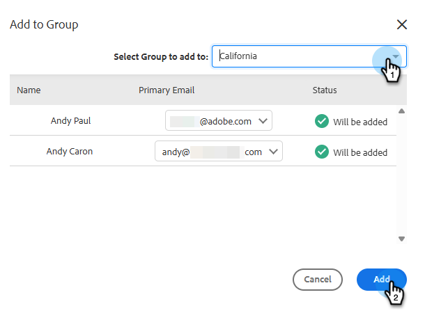

# グループの管理 {#manage-groups}

Sales Insight Actions でグループを管理する方法を説明します。

## グループタイプ {#group-types}

<table> 
 <colgroup> 
  <col> 
  <col> 
 </colgroup> 
 <tbody> 
  <tr> 
   <th>グループ</th> 
   <th>説明</th> 
  </tr> 
  <tr> 
   <td>すべてのリード</td> 
   <td>表示可能なすべてのユーザのすべての取引先責任者。</td> 
  </tr> 
  <tr> 
   <td>動的グループ</td> 
   <td>マイ連絡先：所有しているすべての取引先責任者。 配信停止：通信の受信をオプトアウトした取引先責任者。</td> 
  </tr> 
  <tr> 
   <td>マイグループ</td> 
   <td>作成したグループ。自分の取引先責任者や、自分と共有されている取引先責任者を含めることができます。</td> 
  </tr> 
  <tr> 
   <td>チームグループ</td> 
   <td>自分と共有されているグループ、または自分が共有しているグループ。チームメイトが所有している取引先責任者や、共有した取引先責任者を含めることができます。</td> 
  </tr> 
 </tbody> 
</table>

## グループの作成 {#create-a-group}

1. 人物ページで、グループの横の「**+**」アイコンをクリックします。

   

1. グループに名前を付け、「**作成**」をクリックします。

   

   これで完了です。

## グループに取引先責任者を追加 {#add-contacts-to-a-group}

1. 人物ページで、人物を追加するグループを探して選択します。

   

1. 「**グループアクション**」を選択し、「**取引先責任者を作成してグループに追加**」を選択します。

   

   >[!NOTE]
   >
   >これにより、一度に 1 件の取引先責任者が追加されます。複数の取引先責任者を同時に追加するには、[これらの手順](/help/marketo/product-docs/marketo-sales-insight/actions/people/managing-contacts/import-contacts-via-csv.md)に従います。

1. 取引先責任者の情報を入力し、「**作成**」（または別の取引先責任者を追加する場合は「**作成して新たに追加**」）をクリックします。

   

   これで完了です。

   >[!NOTE]
   >
   >新しく追加された取引先責任者を表示するには、「更新」を押す必要がある場合があります。

## グループの共有 {#share-a-group}

1. 人物ページで、共有するグループを見つけて選択します。

   

1. 縦並びの 3 つのドットをクリックし、「**共有**」を選択します。

   

1. ドロップダウンをクリックし、グループを共有するチームを選択して、「**共有**」をクリックします。

   

   グループは引き続き所有していますが、_チームグループ_&#x200B;で表示されます。

## グループの共有解除 {#unshare-a-group}

1. 人物ページで、共有を解除するグループを見つけて選択します。

   

1. 縦並びの 3 つのドットをクリックし、「**共有**」を選択します。

   

1. 次をクリック：グループを共有したチームの横にある「**X**」をクリックし、モーダルの外側をクリックします。

   

   グループの共有が解除されます。

## グループ名の変更 {#rename-a-group}

1. 人物ページで、名前を変更するグループを見つけて選択します。

   

1. 縦並びの 3 つのドットをクリックし、「**編集**」を選択します。

   

1. 新しい名前を入力し、「**保存**」をクリックします。

   

## グループの削除 {#delete-a-group}

1. 人物ページで、削除するグループを見つけて選択します。

   

1. 縦並びの 3 つのドットをクリックし、「**削除**」を選択します。

   

1. 「**削除**」をクリックして確定します。

   
