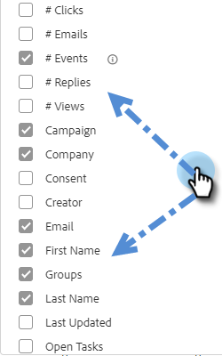

# 人物ページの列 {#people-page-columns}

表示する列を選択して、表示する取引先責任者情報をカスタマイズするオプションがあります。

## 列の選択方法 {#how-to-select-columns}

1. 人物ページで、「リスト設定」アイコンをクリックします。

   

1. スクロールして目的の列を選択します（「**すべてを選択**」を返します）。完了したら、リスト以外の場所をクリックします。

   

## 列の説明 {#column-descriptions}

<table> 
 <colgroup> 
  <col> 
  <col> 
 </colgroup> 
 <tbody> 
  <tr> 
   <th>列</th> 
   <th>説明</th> 
  </tr> 
  <tr> 
   <td>名（デフォルト）</td> 
   <td>名</td> 
  </tr> 
  <tr> 
   <td>姓（デフォルト）</td> 
   <td>姓</td> 
  </tr> 
  <tr> 
   <td colspan="1">電子メール（デフォルト）</td> 
   <td colspan="1">メールアドレス</td> 
  </tr> 
  <tr> 
   <td colspan="1">電話</td> 
   <td colspan="1">電話番号</td> 
  </tr> 
  <tr> 
   <td colspan="1">タイトル（デフォルト）</td> 
   <td colspan="1">役職</td> 
  </tr> 
  <tr> 
   <td>会社（デフォルト）</td> 
   <td>企業名</td> 
  </tr> 
  <tr> 
   <td>キャンペーン（デフォルト）</td> 
   <td>人物に対して現在実施中のセールスキャンペーン</td> 
  </tr> 
  <tr> 
   <td># キャンペーン</td> 
   <td>人物が属しているセールスキャンペーンの合計数</td> 
  </tr> 
  <tr> 
   <td>通話数</td> 
   <td>この人物に対して行われた通話の合計数</td> 
  </tr> 
  <tr> 
   <td># メール</td> 
   <td>この人物に送信されたメールの合計数</td> 
  </tr> 
  <tr> 
   <td>タスク期日</td> 
   <td>タスクの期限</td> 
  </tr> 
  <tr> 
   <td># イベント（デフォルト）</td> 
   <td>人物別のエンゲージメントイベントの合計数（表示数、クリック数および返信数）</td> 
  </tr> 
  <tr> 
   <td># アクティビティ数（デフォルト）</td> 
   <td>このリードに対してユーザが行ったアクティビティの合計数（メール、通話、タスク）</td> 
  </tr> 
  <tr> 
   <td>同意</td> 
   <td>
正当な利益、契約の履行、法的義務の遵守、重大利益の保護、公益／職務権限等
</td> 
  </tr> 
  <tr> 
   <td>進行中のタスク</td> 
   <td>この人物のオープンタスク数</td> 
  </tr> 
  <tr> 
   <td># ビュー数</td> 
   <td>この人物による合計閲覧数</td> 
  </tr> 
  <tr> 
   <td># クリック数</td> 
   <td>この人物によるクリック総数</td> 
  </tr> 
  <tr> 
   <td># 返信数</td> 
   <td>この人物による返信の合計数</td> 
  </tr> 
  <tr> 
   <td>最終更新日</td> 
   <td>人物レコードの最終更新日：</td> 
  </tr> 
  <tr> 
   <td>クリエイター</td> 
   <td>人物を作成したユーザの名前</td> 
  </tr> 
  <tr> 
   <td>ソース</td> 
   <td>人物が作成されたソース元</td> 
  </tr> 
  <tr> 
   <td>グループ（デフォルト）</td> 
   <td>人物が属しているグループ</td> 
  </tr> 
  <tr> 
   <td colspan="1">配信停止済み</td> 
   <td colspan="1">セールス配信停止ステータス</td> 
  </tr> 
 </tbody> 
</table>
