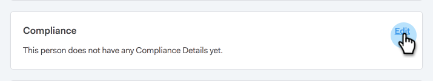
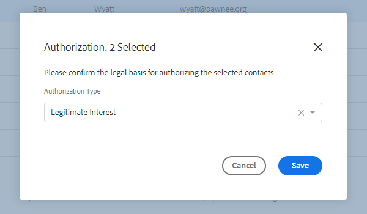

# Sales Insight のアクションと GDPR コンプライアンス {#sales-insight-actions-and-gdpr-compliance}

EU 一般データ保護規則 (GDPR) は、2018 年 5 月 25 日に施行された欧州連合の法律です。

## 概要 {#overview}

その目的は、EU（欧州連合）と EEA（欧州経済圏）内のデータ主体の個人データの使用と保護の方法に関する権利を強化することです。 「個人データ」とは、識別された自然人や識別可能な自然人に関する情報を指します。

GDPR は、次の 6 つの主要な原則に基づいて構成されています（法の第 5 条で詳しく説明）。

1. データの使用方法と用途に関する透明性。
1. 収集されたデータが、収集時に明示的に指定された目的でのみ使用されるようにします。
1. データ収集を、収集の目的に使用するために必要なものに制限する。
1. データが正確であることを確認します。
1. 意図した目的内で必要な期間だけデータを保存する。
1. 適切なセキュリティ対策を導入することで、データの不正使用や誤った損失を防ぎます。

さらに、コンプライアンスの管理と追跡の方法を示すための新しいアカウンタビリティ要件もあります。 つまり、個人データの収集方法と収集理由の記録と、個人データを保護するために導入されたプロセスのドキュメントを保持します。

## 誰に適用されますか？ {#to-whom-does-it-apply}

GDPR は、EU 内または EEA 外で、EU 内のデータ主体に対するマーケティング商品やサービスを行っている、または EU 内のデータ主体の行動を追跡している組織に適用されます。 ヨーロッパで個人データの処理を伴うデータ主体と取引を行う場合、この法律が適用されます。 規制違反者に対する大規模な罰金を科し、コンプライアンス違反に対する罰則は重要です。1 回の違反に対する最大罰金は、世界の年間売上高の 2,000 万ユーロまたは 4%のいずれか大きい方です。

## マーケティングに対する影響 {#implications-for-marketing}

マーケターは、個人的で人間的な感覚を持ち、信頼に基づいて構築され、ケアを通じて提供される顧客体験を作成することを目的としています。 GDPR ではこれらの用語を使用しませんが、目標は同じです。顧客の権利を尊重し、信頼を得るためです。 信頼を構築し維持するには、マーケターは、顧客が関与する方法、タイミング、理由に従う必要があります。 顧客の好みは、法的要件としてだけでなく、顧客中心のエンゲージメントプラクティスの基盤として尊重されることが重要です。

マーケターが、業務上日常的に使用される個人データの収集、使用、セキュリティに関して、これらの高い期待にどのように対処するかが重要です。Marketoは、これらの期待に応えるのに役立ちます。

GDPR には、過去、現在、将来のプラクティスをマーケターが確認する必要がある重要な側面が 2 つあります。 1 つ目は、個人が個人データを処理することに同意すること、もう 1 つは、説明責任、すなわち、GDPR の原則がどのように遵守されているかを示すことができることです。

当社は、電子ブックにMarketoプラットフォーム内の同意と説明責任に関する広範な情報を提供します。 [GDPR とマーケター](https://www.marketo.com/ebooks/the-gdpr-and-the-marketer/). ただし、この記事では、GDPR ルールの遵守に役立つ Sales Insight アクションの新機能に特に焦点を当てます。

## Sales Insight アクションの GDPR コンプライアンス {#gdpr-compliance-in-marketo-sales-connect}

Sales Insight Actions は、Marketo Engagement Platform の一部である強力なアプリケーションで、セールスとマーケティングのための単一のワークフローとビューを提供し、協調エンゲージメントによってパイプラインをより迅速に推進します。 Sales Insight アクションの新機能は、GDPR コンプライアンスを念頭に置いて作成されました。 3 つの機能の概要を説明し、適切に使用すれば、お客様の組織の GDPR コンプライアンス活動に役立つ情報を提供します。

## コンプライアンスカード {#compliance-card}

Sales Insight Actions には、担当者詳細ビューのコンプライアンスカードが含まれ、連絡先の認証タイプとそのソースタイプに関する重要な情報を提供します。 これにより、ユーザーは、データのプライバシーにとって重要な情報を簡単に追加および追跡でき、キャンペーン/アウトリーチ戦略に関して、より十分な情報に基づいた意思決定をおこなうのに役立ちます。

**連絡先認証タイプ**

コンプライアンスカード内のユーザーは、認証ドロップダウンを使用して、連絡先の個人データを処理する法的根拠を追跡できます。 連絡先の承認タイプを把握すると、Sales Insight Actions のユーザーは、アウトリーチプラクティスに関する情報に基づく意思決定を行い、各キャンペーンまたはエンゲージメントが法的かつ適切であることを確認するのに役立ちます。

ユーザーは、次のように、様々な選択肢から選択できます。

* 同意
* 正当な利益
* 連絡先のパフォーマンス
* 法的義務の順守
* 重大利益の保護
* 公益/職務権限
* その他

**連絡先ソースタイプ**

新しいコンプライアンスカード内で、ユーザーは連絡先のソースを追跡できます。 ソース・タイプは、Sales Insight アクションに最初にアップロードされた際に、連絡先の情報がどこから来たかを定義します。 連絡先のソースタイプを把握すると、アウトリーチプラクティスに関する決定や、個人データを保存する他のシステムや場所の決定にも役立ち、各エンゲージメントが GDPR 法に準拠していることを確認できます。

この場合も、ユーザーには、次のような多数のドロップダウンオプションがあります。

* CRM 同期
* 読み込み
* 手動アップロード
* Chrome 拡張機能
* その他

**コンプライアンスカードの編集**

担当者詳細ビューが開いたら、 **編集** 」をクリックします。

次の 2 つのドロップダウンが表示されます。認証タイプとソースタイプ。

承認タイプとして「同意」を選択した場合は、次の 2 つの必須フィールドがあります。「同意日」と「処理の目的」が表示されます。 これら 2 つのフィールドは、他のオプションには適用されません。

[ 認証の種類 ] または [ ソースの種類 ] に [ その他 ] を選択した場合は、ソースの種類を説明するテキストを入力できます。

**一括アクション**

また、Sales Insight のアクションを使用すると、連絡先の認証とソースのタイプを一括で更新し、コンプライアンスプロセスの貴重な時間を節約できます。

人物ページから 1 つ以上の連絡先を選択すると、右側にドット（3 ドットメニュー）が表示されます。 クリックすると、[Authorization] と [Source] がオプションになります。 複数の連絡先の認証またはソースを同時に設定できます。

「認証」モーダルをクリックすると、「コンプライアンスカード」のドロップダウンオプションに一致するポップアップが表示されます。

[ 認証の種類 ] が更新されると、確認ポップアップが表示され、[ 担当者の詳細 ] ビューの [ コンプライアンス ] カードに更新された詳細が表示されます。

同様に、「ソースタイプ」も、「ソース」モーダルをクリックすることで、一括で更新できます。

選択した連絡先に対して正しいソースの種類を選択すると、更新が成功したことを確認する確認ウィンドウが表示されます。

## Sales Insight アクションからの連絡先データのエクスポート {#exporting-contact-data-from-marketo-sales-connect}

担当者詳細ビューから連絡先情報を書き出すことができます。 書き出すと、次の列を含む.CSV ファイルがダウンロードされます。

<table> 
 <colgroup> 
  <col> 
  <col> 
  <col> 
 </colgroup> 
 <tbody> 
  <tr> 
   <td>名 </td> 
   <td>Web サイト</td> 
   <td>Facebook</td> 
  </tr> 
  <tr> 
   <td>姓</td> 
   <td>その他</td> 
   <td>Twitter</td> 
  </tr> 
  <tr> 
   <td>企業</td> 
   <td>更新時刻</td> 
   <td>LinkedIn</td> 
  </tr> 
  <tr> 
   <td>職位</td> 
   <td>作成日時</td> 
   <td>エクスポート時間</td> 
  </tr> 
  <tr> 
   <td>メール ID</td> 
   <td>Salesforce ID</td> 
   <td> </td> 
  </tr> 
  <tr> 
   <td>電話番号</td> 
   <td>顧客 ID</td> 
   <td> </td> 
  </tr> 
 </tbody> 
</table>

>[!NOTE]
>
>一度に 1 件の連絡先に対してのみ実行できます。 現在、連絡先の一括書き出しを許可する機能はありません。

連絡先情報を書き出すには、担当者詳細ビューヘッダーの縦並びの 3 ドットをクリックし、 **書き出し**. .CSV ファイルは自動的にダウンロードされます。

>[!NOTE]
>
>また、GDPR では UI から連絡先を削除する機能も必要ですが、Sales Insight のアクションには既にこの機能があります。

## 配信停止 {#unsubscribes}

GDPR の一般的に誤解される領域として、組織のデータベースから配信停止する連絡先が含まれます。 配信停止を選択したユーザーのデータの保護に関する新しいルールに従うため、Sales Insight アクションには次の機能が含まれています。

**配信停止リンク：** 配信停止リンクは、セールスコネクト Web アプリケーションから送信されるすべてのメールに自動的に追加され、連絡先にアクセス可能なオプトアウト方法が提供されます。\
**配信停止同期：** ユーザーは、CRM(Salesforce) との購読解除を同期して、オプトアウトが最新の状態に保つことができます。\
**配信停止履歴：** ユーザーは、過去のオプトアウトおよびオプトインをユーザーの詳細表示で確認できます。\
**配信停止の削除：** 配信停止済みの連絡先を再度オプトインするには、ユーザーが管理者権限を持っている必要があり、連絡先が連絡先に対して新たな同意を与えたことを示す必要があります。

## 今後の更新 {#future-updates}

エンゲージメント経済のパワーと顧客中心性を熱狂的に支持するMarketoは、プライバシーとデータ保護をデータ主体に委ねることの重要性を理解しています。 他のデータ保護法と同様に、GDPR コンプライアンスには、Marketoとお客様の両方からのコミットメントが必要です。 この記事は、Marketoを組織の GDPR コンプライアンスに適した方法で使用する際に役立つように作成されています。

アドビでは、引き続き、規制当局および関連法律が発行した、適用可能な GDPR ガイダンスを厳密に追跡します。 更新情報は、次の場所にあるアドビのセキュリティセンターに投稿されます： [trust.marketo.com](https://trust.marketo.com).
