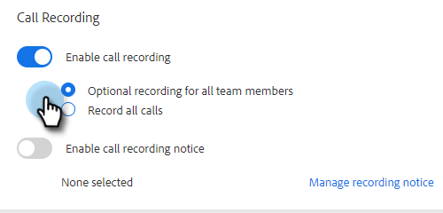

# 通話記録の有効化 {#enable-call-recording}

管理者は、[!DNL Sales Insight Actions] 通話の通話記録を有効にできます。チームの通話を録音することは、通話のベストプラクティスをセールス担当者に指導する優れた方法です。

1. 「設定」アイコンをクリックし、「**[!UICONTROL 設定]**」を選択します。

   

1. 「[!UICONTROL 管理者設定]」で、「**[!UICONTROL ダイヤラー]**」をクリックします。

   

1. 「**[!UICONTROL 通話録音を有効にする]**」切替スイッチを選択します。

   

1. セールス担当者に対し、自分で通話記録を有効または無効にする機能を提供する場合は、「**[!UICONTROL すべてのチームメンバーに対するオプションの記録]**」をクリックします。すべての通話を自動的に記録する場合は、「**[!UICONTROL すべての通話を記録]**」をクリックします。

   

>[!MORELIKETHIS]
>
>[二者間による同意の設定](/help/marketo/product-docs/marketo-sales-insight/actions/phone/two-party-consent-settings.md)
