# Salesforce に通話理由と通話結果を記録 {#log-call-reasons-and-call-outcomes-to-salesforce}

レポートや表示の目的で、通話の結果や通話理由を Salesforce に記録する場合は、それぞれにカスタムアクティビティフィールドを作成できます。 各フィールドは、特定の API 名（Salesforce では「フィールド名」と呼ばれます）を使用する必要があります。

* 通話の結果フィールド名：mktosales_call_outcome
* 通話理由フィールド名：mktosales_call_reason

これらのフィールドを利用するには、まず、カスタムアクティビティフィールドとしてフィールドを作成する必要があります。 ユーザに表示するには、タスクオブジェクトのページレイアウトに追加する必要があります。

## Salesforce Classic {#salesforce-classic}

### Salesforce Classic でのカスタムアクティビティフィールドの作成  {#create-custom-activity-field-in-salesforce-classic}

1. Salesforce で、「**設定**」をクリックします。

   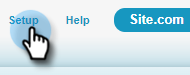

1. クイック検索ボックスに「アクティビティ」と入力します。

   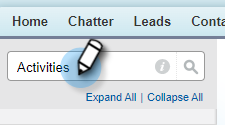

1. 「**アクティビティカスタムフィールド**」をクリックします。

   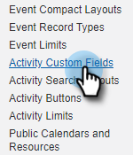

1. 「**新規**」をクリックします。

   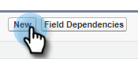

1. データタイプ「テキスト」を選択し、「**次へ**」をクリックします。

   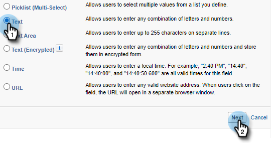

1. カスタムフィールドに、上で定義したフィールド名を付けます。 フィールドの長さの上限は 255 文字です。 フィールドラベルは、セールスチームが表示できるフィールドで、チームのニーズに合わせてカスタマイズできます。

   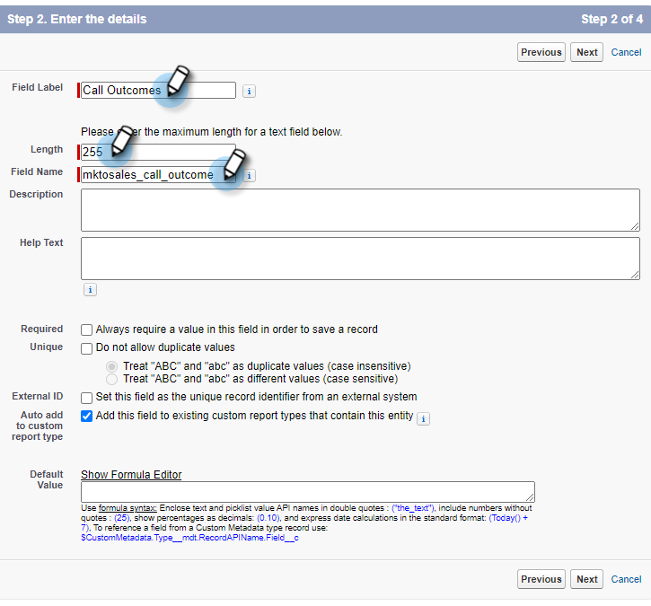

1. 残りの設定はオプションです。 設定が完了したら、「**次へ**」をクリックします。

   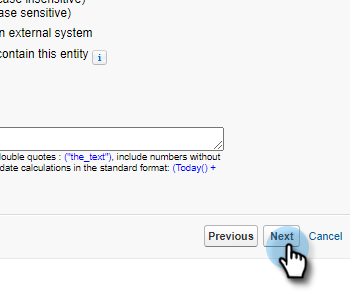

1. このフィールドの目的のフィールドレベルのセキュリティ設定を選択し、「**次へ**」をクリックします（以下の画像は一例です）。

   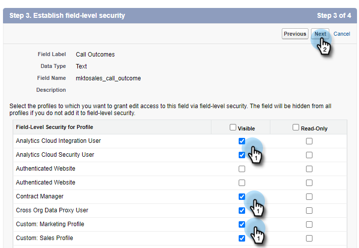

   >[!NOTE]
   >
   >セールスインサイトアクションユーザが使用するプロファイルと、他に表示するプロファイルにカスタムフィールドが表示されていることを確認します。

1. フィールドを追加するページレイアウトを選択し、「**保存**」をクリックします（オプションで、「**保存して新規作成**」をクリックし、「通話理由」フィールドに対してこのプロセスを繰り返すことができます）。

   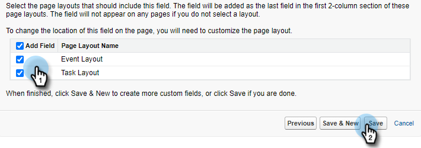

### Salesforce Classic のタスクページレイアウトにカスタムアクティビティフィールドを追加する {#add-custom-activity-field-to-task-page-layout-in-salesforce-classic}

>[!NOTE]
>
>上記の手順 9 で目的のページレイアウトを選択しなかった場合にのみ、これらの手順に従う必要があります。

1. Salesforce で、「**設定**」をクリックします。

   

1. クイック検索ボックスに「タスク」と入力します。

   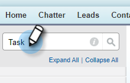

1. 「**タスクページレイアウト**」をクリックします。

   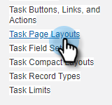

1. このフィールドを追加するタスクページレイアウトの横にある「**編集**」をクリックします。

   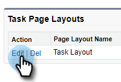

1. フィールドをタスクページレイアウトの目的のセクションにドラッグ＆ドロップします。

   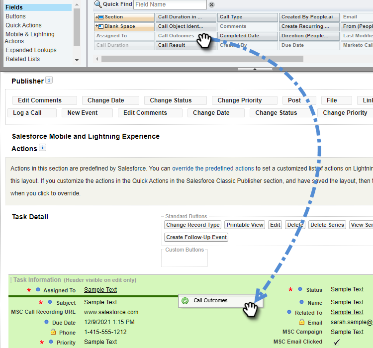

1. 「**保存**」をクリックします。

   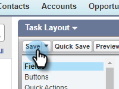

## Salesforce Lightning {#salesforce-lightning}

### Salesforce Lightning でカスタムアクティビティフィールドを作成する {#create-custom-activity-field-in-salesforce-lightning}

1. Salesforce で、右上の歯車アイコンをクリックし、「**設定**」を選択します。

   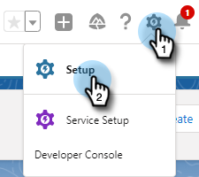

1. 「**オブジェクトマネージャー**」をクリックします。

   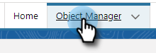

1. クイック検索ボックスに「アクティビティ」と入力します。

   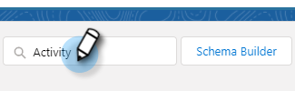

1. 「**アクティビティ**」ラベルをクリックします。

   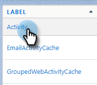

1. 「**フィールドと関係**」をクリックします。

   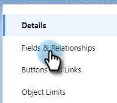

1. 「**新規**」をクリックします。

   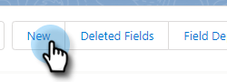

### Salesforce Lightning のタスクページレイアウトにカスタムアクティビティフィールドを追加する {#add-custom-activity-field-to-task-page-layout-in-salesforce-lightning}

1. Salesforce で、右上の歯車アイコンをクリックし、「**設定**」を選択します。

   

1. 「**オブジェクトマネージャー**」をクリックします。

   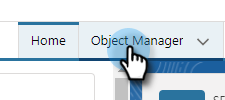

1. クイック検索ボックスに「タスク」と入力します。

   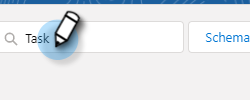

1. 「**タスク**」ラベルをクリックします。

   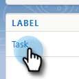

1. 「**ページレイアウト**」をクリックします。

   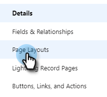

1. このフィールドを追加するタスクページレイアウトをクリックします。

   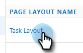

1. フィールドをタスクページレイアウトの目的のセクションにドラッグ＆ドロップします。

   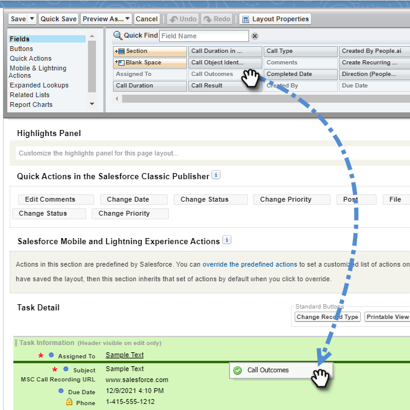

1. 「**保存**」をクリックします。

   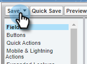

>[!MORELIKETHIS]
>
>* [通話結果](/help/marketo/product-docs/marketo-sales-insight/actions/phone/call-outcomes.md)
>* [通話理由](/help/marketo/product-docs/marketo-sales-insight/actions/phone/call-reasons.md)
