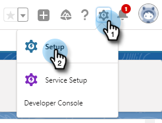
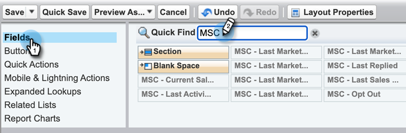
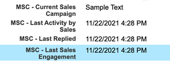

# Salesforce Lightning カスタマイズパッケージのアンインストール {#uninstall-salesforce-lightning-customization-package}

MSI アクションパッケージの使用を開始したら、Salesforce アカウントからMarketoセールスコネクトパッケージをアンインストールします。

## ページレイアウトからセールスコネクトフィールドを削除 {#remove-sales-connect-fields-from-page-layout}

1. Salesforce Lightning で、歯車アイコンをクリックし、 **設定**.

   

1. クリック **オブジェクトマネージャ**.

   

1. 下にスクロールして、「 」を選択します。 **リード**.

   

1. 「**ページレイアウト**」をクリックします。

   

1. クリック **リードのレイアウト**.

   

   >[!NOTE]
   >
   >Salesforce Lightning のページレイアウトの編集ビューは、まだ更新されていません。

1. コンソールで、 **フィールド**. クイック検索で「MSC」を検索します。 灰色表示のフィールドはすべて、ページレイアウトに追加されています。 削除する必要があります。

   

   >[!NOTE]
   >
   >灰色表示になっているフィールドがない場合は、まだページレイアウトに追加されていないことを意味します。 この節はスキップできます。

1. セールスコネクトのカスタムフィールドが設定されたセクションにスクロールします。

   

1. このセクションに追加できる MSC フィールドは 10 種類あります。 追加したすべてのフィールドを削除するか、単にセクション全体を削除します。

1. クリック **クイック保存** 完了したら、

   

## ページレイアウトからセールスコネクトボタンを削除 {#remove-sales-connect-buttons-from-page-layouts}

1. コンソール（上記の手順 4）で、「 」を選択します。 **ボタン**. 「MSC」を検索します。 灰色表示のボタンがすべて、カスタムボタンセクションに追加されました。 削除する必要があります。

   

   >[!NOTE]
   >
   >灰色表示になっているボタンがない場合は、まだ追加されていないことを意味します。 この節はスキップできます。

1. 「カスタムボタン」セクションからコンソールに MSC ボタンをドラッグ&amp;ドロップします。

   

1. クリック **クイック保存** 完了したら、

   

## [ アクティビティ履歴 ] セクションからセールスコネクトフィールドを削除 {#remove-sales-connect-fields-from-activity-history-section}

1. ページの下部までスクロールして、「アクティビティ履歴」関連リストセクションに移動し、レンチアイコンをクリックします。

   

1. [ 選択したフィールド ] 領域で [ セールスコネクトフィールド ] を選択し、[ 削除 ] 矢印をクリックします。 終了したら「**OK**」をクリックします。

   

   >[!NOTE]
   >
   >アブレベーション MSE _が_ セールスコネクト。 これは「Marketo Sales Engage」という名前です

1. クリック **保存** 「リード」ページの操作が完了したら、

## リードリストビューからセールスコネクトの一括アクションボタンを削除 {#remove-sales-connect-bulk-action-buttons-from-lead-list-view}

1. Salesforce Lightning で、歯車アイコンをクリックし、 **設定**.

   

1. クリック **オブジェクトマネージャ**.

   

1. 下にスクロールして、「 」を選択します。 **リード**.

   

1. クリック **検索レイアウト**.

   

1. リスト表示の横の矢印をクリックし、 **編集**.

   

1. 選択 **MSC キャンペーンに追加**, **MSC でのメール**、および **MSC にプッシュ**&#x200B;をクリックし、「削除」矢印をクリックします。 「**保存**」をクリックします。

   

リードリストビューにボタンが表示されなくなりました。

## 連絡先の MSC 構成を削除 {#remove-msc-configuration-for-contacts}

1. Salesforce Lightning で、歯車アイコンをクリックし、 **設定**.

1. クリック **オブジェクトマネージャ**.

1. 下にスクロールして、「 」を選択します。 **連絡先**.

1. 「**ページレイアウト**」をクリックします。

1. クリック **連絡先のレイアウト**.

1. 3 つのセクションすべてから手順を繰り返します。

## 商談の MSC 構成を削除 {#remove-msc-configuration-for-opportunity}

1. Salesforce Lightning で、歯車アイコンをクリックし、 **設定**.

1. クリック **オブジェクトマネージャ**.

1. 下にスクロールして、「 」を選択します。 **商談**.

1. 「**ページレイアウト**」をクリックします。

1. クリック **商談のレイアウト**.

オポチュニティビューには、「MSE メールを送信」と次のフィールドのボタンが 1 つだけあります。

## アカウントの MSC 構成を削除 {#remove-msc-configuration-for-account}

1. Salesforce Lightning で、歯車アイコンをクリックし、 **設定**.

1. クリック **オブジェクトマネージャ**.

1. 下にスクロールして、「 」を選択します。 **アカウント**.

1. 「**ページレイアウト**」をクリックします。

1. クリック **アカウントのレイアウト**.

アカウントビューには、「MSE メールを送信」ボタンと次のフィールドのみが表示されます。

## Marketoセールス送信トレイの削除 {#remove-marketo-sales-outbox}

1. Salesforce で、 **+** 」タブをクリックします。

1. クリック **マイタブのカスタマイズ**.

1. 右側の「 Marketo Sales Outbox 」オプションを選択します。 削除矢印をクリックし、 **保存**.

## セールスコネクトパッケージの削除 {#delete-sales-connect-package}

Salesforce アカウントからすべてのオブジェクトを削除したら、次の手順に従います。

1. Salesforce Lightning で、歯車アイコンをクリックし、 **設定**.

1. 「クイック検索」ボックスに、「Apex クラス」と入力します。

1. クリック **削除** リストのすべての「MarketoSalesConnectionCustomization」または「MarketoSalesEngageCustomization」エントリの横に表示されます。

準備は整った！

以下に、Salesforce インスタンスから削除する必要のあるすべてのオブジェクトのリストを示します。

## セールスコネクトのカスタマイズの詳細 {#sales-connect-customization-details}

<table>
 <tr>
  <th>カスタムアクティビティフィールド</th>
  <th>説明</th>
  <th>タイプ</th>
  <th>データタイプ</th>
 </tr>
 <tr>
  <td>MSC 通話ローカルプレゼンス ID</td>
  <td>ユーザーは、MSC Phone から電話をかける際に、「ローカルプレゼンス」をオプションとして選択できます。 着信呼び出しは、受信者のローカル番号を表示します</td>
  <td>アクティビティ</td>
  <td>テキスト</td>
 </tr>
 <tr>
  <td>MSC 通話録音 URL</td>
  <td>通話を記録し、録画のリンクをここに記録できます </td>
  <td>アクティビティ</td>
  <td>テキスト</td>
 </tr>
 <tr>
  <td>MSC キャンペーン</td>
  <td>連絡先/リードが存在する MSC キャンペーンのログ名</td>
  <td>アクティビティ</td>
  <td>テキスト</td>
 </tr>
 <tr>
  <td>MSC キャンペーン URL</td>
  <td>MSC で作成されたキャンペーンの URL を記録します。 これをクリックすると、MSC Web アプリでキャンペーンが開きます</td>
  <td>アクティビティ</td>
  <td>テキスト</td>
 </tr>
 <tr>
  <td>MSC キャンペーンの現在のステップ</td>
  <td>連絡先/リードがキャンペーン上に存在する場合、このフィールドには現在閲覧中のステップの名前が記録されます</td>
  <td>アクティビティ</td>
  <td>チェックボックス</td>
 </tr>
 <tr>
  <td>MSC メール添付ファイルが表示されました</td>
  <td>受信者が閲覧した添付ファイルを含む電子メールが送信された際に、データを記録します</td>
  <td>アクティビティ</td>
  <td>チェックボックス</td>
 </tr>
 <tr>
  <td>MSC メールクリック済み</td>
  <td>受信者が電子メールのリンクをクリックしたときにチェックマークを記録します</td>
  <td>アクティビティ</td>
  <td>チェックボックス</td>
 </tr>
 <tr>
  <td>MSC メール返信済み</td>
  <td>受信者が電子メールに返信したときにチェックマークを記録します</td>
  <td>アクティビティ</td>
  <td>テキスト</td>
 </tr>
 <tr>
  <td>MSC メールステータス</td>
  <td>E メールが送信/進行中/バウンス済みかどうかを表示します（バウンスメールのトラッキングは、使用する配信チャネルに応じて異なります）</td>
  <td>アクティビティ</td>
  <td>テキスト</td>
 </tr>
 <tr>
  <td>MSC メールテンプレート</td>
  <td>リード/連絡先に送信されたメールで使用された MSC テンプレートのログ名</td>
  <td>アクティビティ</td>
  <td>テキスト</td>
 </tr>
 <tr>
  <td>MSC メールテンプレート URL</td>
  <td>MSC で作成されたテンプレートの URL を記録します。 これをクリックすると、MSC Web アプリでテンプレートが開きます</td>
  <td>アクティビティ</td>
  <td>テキスト</td>
 </tr>
 <tr>
  <td>MSC メール URL</td>
  <td>この URL をクリックすると、MSC でコマンドセンターが開き、ユーザーが送信したメールを確認できる「ユーザー詳細ビューの履歴」タブが表示されます</td>
  <td>アクティビティ</td>
  <td>テキスト</td>
 </tr>
 <tr>
  <td>MSC メール閲覧済み</td>
  <td>受信者が電子メールを表示したときにチェックマークを記録します</td>
  <td>アクティビティ</td>
  <td>チェックボックス</td>
 </tr>
</table>

<table>
 <tr>
  <th>MSC ロールアップログフィールド</th>
  <th>説明</th>
  <th>タイプ</th>
  <th>データタイプ</th>
 </tr>
 <tr>
  <td>MSC — 最後のマーケティングエンゲージメント</td>
  <td>マーケティングから最後に入ってくるエンゲージメント</td>
  <td>
  
アカウント
  
取引先責任者
  
リード
  
商談</td>
  <td>データと時間</td>
 </tr>
 <tr>
  <td>MSC — 最終マーケティングエンゲージメント日</td>
  <td>マーケティングによるエンゲージメントのタイムスタンプ</td>
  <td>
  
アカウント 
  
取引先責任者 
  
リード 
  
商談</td>
  <td>データと時間</td>
 </tr>
 <tr>
  <td>MSC — 最終マーケティングエンゲージメントの説明</td>
  <td>エンゲージメントの説明</td>
  <td>
  
アカウント 
  
取引先責任者 
  
リード 
  
商談</td>
  <td>テキスト</td>
 </tr>
 <tr>
  <td>MSC — 最後のマーケティングエンゲージメントソース</td>
  <td>マーケティングエンゲージメントのソース</td>
  <td>
  
アカウント 
  
取引先責任者 
  
リード 
  
商談</td>
  <td>テキスト</td>
 </tr>
 <tr>
  <td>MSC — 最終マーケティングエンゲージメントタイプ</td>
  <td>エンゲージメントのタイプ ( 例：Web アクティビティ )</td>
  <td>
  
アカウント 
  
取引先責任者 
  
リード 
  
商談</td>
  <td>テキスト</td>
 </tr>
 <tr>
  <td>MSC — セールス別最後のアクティビティ</td>
  <td>セールスチームが実行した最後の送信アクティビティ</td>
  <td>
  
アカウント 
  
取引先責任者 
  
リード 
  
商談</td>
  <td>データと時間</td>
 </tr>
 <tr>
  <td>MSC — 最後の返信日</td>
  <td>セールスメールへの最後のメール返信</td>
  <td>
  
アカウント 
  
取引先責任者 
  
リード 
  
商談</td>
  <td>データと時間</td>
 </tr>
 <tr>
  <td>MSC — 現在のセールスキャンペーン</td>
  <td>連絡先/リードが存在する MSC キャンペーンのログ名</td>
  <td>
  
アカウント 
  
取引先責任者 
  
リード 
  
商談</td>
  <td>テキスト</td>
 </tr>
 <tr>
  <td>MSC — 最終セールスエンゲージメント</td>
  <td>セールスからの最後の受信エンゲージメント</td>
  <td>
  
アカウント
  
取引先責任者
  
リード
  
商談</td>
  <td>データと時間</td>
 </tr>
 <tr>
  <td>MSC — オプトアウト</td>
  <td>オプトアウトフィールド</td>
  <td>
  
アカウント 
  
取引先責任者 
  
リード 
  
商談</td>
  <td>チェックボックス</td>
 </tr>
</table>

<table>
 <tr>
  <th>MSC ボタン</th>
  <th>説明</th>
  <th>タイプ</th>
 </tr>
 <tr>
  <td>MSC メールを送信</td>
  <td>Salesforce からセールスメールを送信</td>
  <td>
  
アカウント 
  
取引先責任者 
  
リード 
  
商談</td>
 </tr>
 <tr>
  <td>MSC キャンペーンに追加</td>
  <td>Salesforce から MSC キャンペーンに追加</td>
  <td>
  
取引先責任者
  
リード</td>
 </tr>
 <tr>
  <td>MSC にプッシュ</td>
  <td>Salesforce から MSC に連絡先をプッシュ</td>
  <td>
  
取引先責任者
  
リード</td>
 </tr>
 <tr>
  <td>MSC で通話</td>
  <td>Salesforce からセールス電話をかける</td>
  <td>
  
取引先責任者
  
リード</td>
 </tr>
</table>

<table>
 <tr>
  <th>MSC 一括アクションボタン</th>
  <th>説明</th>
  <th>タイプ</th>
 </tr>
 <tr>
  <td>MSC キャンペーンに追加</td>
  <td>Salesforce から MSC キャンペーンに追加</td>
  <td>
  
取引先責任者
  
リード</td>
 </tr>
 <tr>
  <td>MSC にプッシュ</td>
  <td>Salesforce から MSC に連絡先をプッシュ</td>
  <td>
  
取引先責任者
  
リード</td>
 </tr>
 <tr>
  <td>MSC でのメール</td>
  <td>Salesforce から MSC でメールを送信</td>
  <td>
  
取引先責任者
  
リード</td>
 </tr>
</table>
