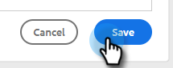

# ハイパーリンクテキストの追加 {#add-hyperlinked-text}

メールテンプレートにハイパーリンクを追加する手順は以下のとおりです。

1. [!UICONTROL テンプレート]ページで、目的のテンプレートを選択します（または新しく作成します）。

   

1. 「**[!UICONTROL 編集]**」をクリックします。

   

1. ハイパーリンクするテキスト（「ここをクリック」等）を入力します。 テキストを[!DNL Highlight]して、エディターのリンクボタンをクリックします。

   

1. リンク先の URL を入力します（例：`https://experienceleague.adobe.com/docs/marketo/using/home.html`）。 URL を同じウィンドウで開くか、新しいウィンドウで開くかを選択し、「**[!UICONTROL 保存]**」をクリックします。

   

1. 再度「**[!UICONTROL 保存]**」をクリックします。

   

>[!NOTE]
>
>編集するテンプレートが現在、任意のキャンペーンのメールステップとして使用されている場合、特定（またはすべて）のキャンペーンの文字列を更新するオプションが表示されます。
