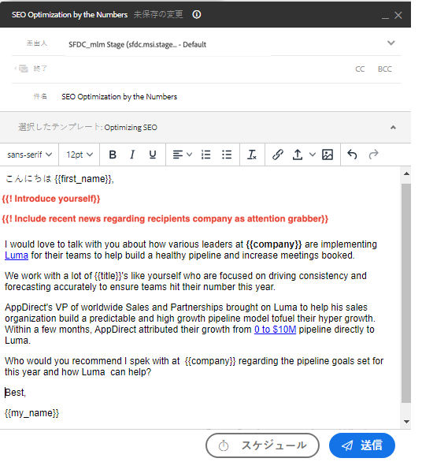

# フィールドプロンプト {#field-prompts}

フィールドプロンプトでは、E メールを送信する前に削除または置き換える必要がある E メールに文字列を追加できます。 これは、追加のパーソナライゼーションを追加するようにユーザーに促す優れた方法です。

フィールドプロンプトを追加するには、目的のテキストを入力します。 感嘆符で始め、中括弧で囲みます（以下を参照）。

**例:**

`{{! Introduce yourself}}`

`{{! Insert name of Account Executive}}`

`{{! Add sentence that references their industry and role}}`

ユーザーは、E メールを送信する前に、このテキストを自分のパーソナライゼーションに置き換える必要があります。

>[!NOTE]
>
>セールスキャンペーンでプロンプトを使用する場合は、手動のメールステップで使用することをお勧めします。 これらの手順では、ユーザーにリマインダータスクを割り当てて電子メールを送信し、プロンプトをカスタムテキストに置き換える機会を提供します。 セールスキャンペーンの自動メールステップは、ユーザーがプロンプトを置き換えることなく、自動的に送信を試みます。 置き換えられていないプロンプトが表示されると、E メールの送信に失敗します。
