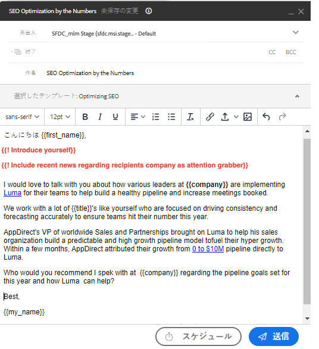

# フィールドプロンプト {#field-prompts}

フィールドプロンプトを使用すると、メールが送信できるようになる前に、削除または置換される必要があるテキストの文字列をメールに追加できます。これは、ユーザーに追加のパーソナライゼーションを追加することを思い出させるのに最適な方法です。

フィールドプロンプトを追加するには、目的のテキストを入力します。感嘆符で開始して、中括弧で囲みます（以下を参照）。

**例：**

`{{! Introduce yourself}}`

`{{! Insert name of Account Executive}}`

`{{! Add sentence that references their industry and role}}`

ユーザーは、メールが送信できるようになる前に、このテキストを独自のパーソナライゼーションに置き換える必要があります。

>[!NOTE]
>
>プロンプトをセールスキャンペーンで使用する場合、手動のメールステップで使用するのが最善です。これらのステップは、メールを送信するためのリマインダータスクにユーザーを割り当てるので、プロンプトをカスタムテキストに置き換えるチャンスがあります。セールスキャンペーンの自動メールステップは、ユーザーにプロンプトの置き換えを許可することなく、自動的に送信しようとします。置き換えられていないプロンプトは、メール送信失敗の原因となります。
