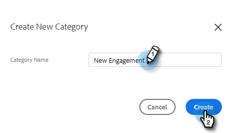
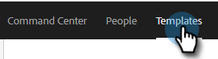

# テンプレートカテゴリの管理 {#manage-template-categories}

## カテゴリの作成 {#create-a-category}

1. 「**[!UICONTROL テンプレート]**」タブをクリックします。

   

1. **カテゴリ**&#x200B;の横にある&#x200B;**[!UICONTROL +]**&#x200B;アイコンをクリックします。

   

1. 新しいカテゴリの名前を入力し、「**[!UICONTROL 作成]**」をクリックします。

   

## テンプレートカテゴリの名前を変更 {#rename-a-template-category}

1. 「**[!UICONTROL テンプレート]**」タブをクリックします。

   

1. 名前を変更するテンプレートにポインターを合わせて、3 つのドットをクリックします。 「**[!UICONTROL 名前を変更]**」を選択します。

   

1. 新しい名前を入力します。 Enter キーを押す（または画面上の他の場所をクリックする）と、保存されます。

   

## テンプレートカテゴリの削除 {#delete-a-template-category}

1. 「**[!UICONTROL テンプレート]**」タブをクリックします。

   

1. 名前を変更するテンプレートにポインターを合わせて、3 つのドットをクリックします。 「**[!UICONTROL 削除]**」を選択します。

   

1. 「**[!UICONTROL 削除]**」をクリックして確定します。

   

>[!NOTE]
>
>カテゴリにテンプレートが含まれている場合、そのカテゴリは削除できません。 カテゴリを削除する前に、すべてのテンプレートを移動または削除します。
