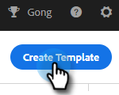

# テンプレートを管理 {#manage-templates}

## テンプレートの作成 {#create-a-new-template}

1. 次に移動： **テンプレート** タブをクリックします。

   

1. クリック **テンプレートを作成**.

   

1. を選択します。 **名前** および **カテゴリ** 電子メールテンプレートの場合は、 **作成**.

   

1. テンプレートエディターで、メールの件名を作成し、必要なメッセージを入力します。編集ツール（フォント、テキストサイズなど）を使用して、表示方法をカスタマイズします。「**保存**」をクリックして、変更を確定します。

   

>[!TIP]
>
>常にテンプレートにテキストを直接入力するか、プレーンテキストエディター（メモ帳、TextEdit など）からコピーします。 リッチテキストエディター（MS Word など）からコピー&amp;ペーストすると、書式が不規則になる場合があります。

## テンプレートの共有 {#share-a-template}

チームアカウントを使用している場合、デフォルトでは、すべてのテンプレートがプライベートになっています。

1. 次に移動： **テンプレート** タブをクリックします。

   

1. 目的のテンプレートを検索して選択します。

   

1. 次をクリック： **共有** 」ボタンをクリックします。

   

   >[!NOTE]
   >
   >共有されているテンプレートは、テンプレートページの左側にある&#x200B;**チームテンプレート**&#x200B;ヘッダーの下に表示されます。チームは、Premium ユーザーのみが使用できます。

1. 「共有するチーム」ドロップダウンをクリックし、共有するチームを選択します。

   

1. テンプレートを現在のカテゴリに保持するか、別のカテゴリに移動するかを選択できます。 この例では、現在の環境に保っています。 クリック **共有** 完了したら、

   

## テンプレートのお気に入りへの登録 {#favorite-a-template}

任意のカテゴリからお気に入りリストにテンプレートを追加できます。これにより、リストの一番上に新しいカテゴリが自動的に生成され、よく使用するテンプレートにすばやくアクセスできるようになります。

1. 次に移動： **テンプレート** タブをクリックします。

   

1. 目的のテンプレートを見つけ、その上にマウスポインターを置きます。 テンプレート名の左側に表示される星をクリックします。

   

   お気に入りに入った後、星は残ります。

   

## テンプレート表示をカスタマイズする {#customize-template-view}

次の **表示** ドロップダウンで、次の項目を選択できます。すべてのテンプレート、お気に入りのテンプレート、共有テンプレート、非共有テンプレートまたは未使用のテンプレート（過去 90 日間使用されていないテンプレート）。

>[!NOTE]
>
>さらに、「表示」ドロップダウンの右にある設定アイコンをクリックして、テンプレートビューで列を追加または削除できます。

## テンプレートのアーカイブ {#archive-a-template}

テンプレートをアーカイブして、テンプレートデータを失うことなく、セールスコンテンツを整理し、集中的に保ちます。

テンプレートの横にあるボックスをオンにして、「**アーカイブ**」をクリックします。

PICC

>[!NOTE]
>
>テンプレートをアーカイブすると、編集も使用もできなくなります。再度使用するには、テンプレートをアーカイブから他のカテゴリに移動します。

また、「未使用」フィルターを選択して、90 日以上使用されていないテンプレートを表示およびアーカイブできます。

## テンプレートの削除 {#delete-a-template}

テンプレートを削除するには、以下の手順に従います。

>[!CAUTION]
>
>テンプレートを削除すると、そノテンプレートに関連付けられているすべてのトラッキングと分析も削除されます。

1. 削除するテンプレートを選択します。

PICC

1. 右上のメニュードロップダウンをクリックし、「**削除**」をクリックします。

PICC

1. 「**削除**」をクリックして確定します。

PICC
